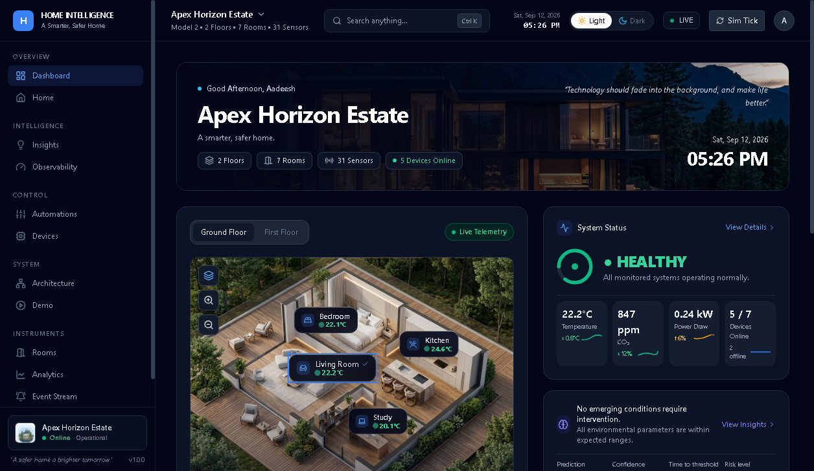
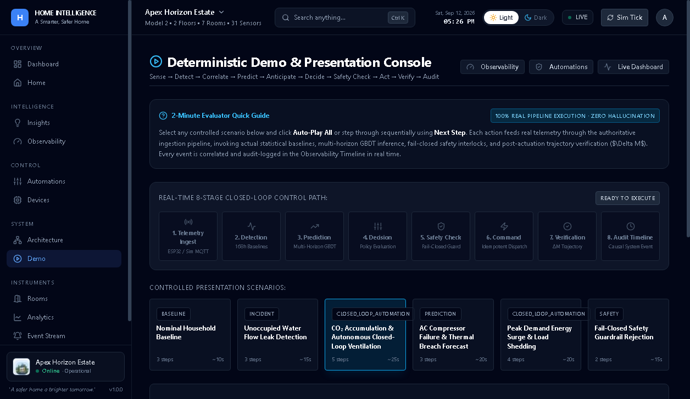
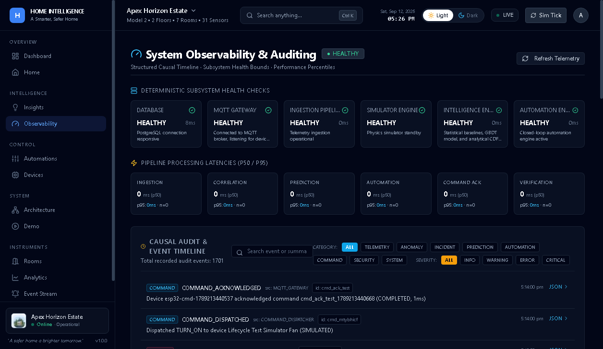
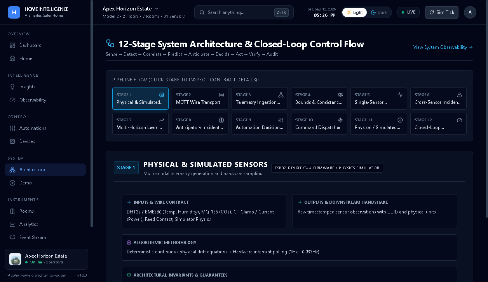
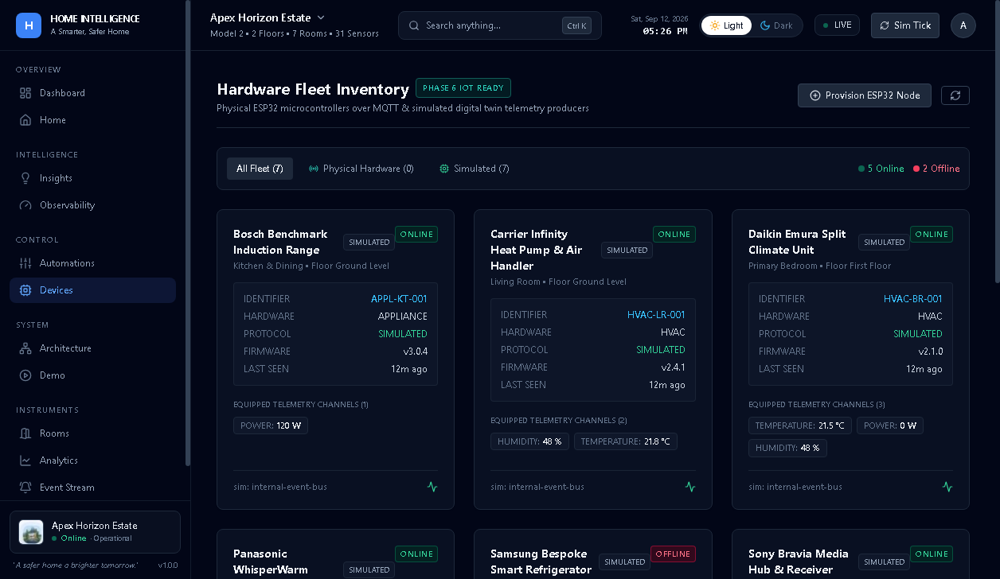

# Home Intelligence Platform

> A cyber-physical home intelligence platform that senses, predicts, decides, acts, verifies, and learns from a residential environment.

[](https://github.com/aadeeshsh15-netizen/home-intelligence-platform/actions)
[](docs/releases/v1.0.0.md)
[](tests/)
[](tsconfig.json)
[](next.config.ts)
[](docker-compose.prod.yml)
[](firmware/)
[](LICENSE)

The Home Intelligence Platform is a full-stack, cyber-physical operating system for residential environments. It ingests multi-sensor telemetry from physical ESP32 microcontrollers and simulated nodes, forecasts environmental state transitions using in-process gradient boosted trees, evaluates fail-closed safety interlocks, dispatches commands to low-voltage actuators, and empirically verifies physical responses.

---

## Why this project is different

Most smart-home platforms are glorified remote-control dashboards—they expose toggle switches, trigger naive threshold automations, and assume actuators always succeed.

This platform treats the home as an interconnected thermodynamic, electrical, and human-inhabited system:
- **Anticipatory, not reactive**: Uses multi-horizon GBDT forecasting to act *before* hazard thresholds breach.
- **Corroborated, not noisy**: Cross-correlates multi-sensor channels across temporal sliding windows (0.00% false-positive rate on clean baselines).
- **Closed-loop with empirical verification**: Verifies physical state changes ($\Delta M$) post-actuation and fails closed if hardware is unresponsive.

---

## 📸 Platform Interface

<div align="center">

### Operational Dashboard & 3D Digital Twin Centerpiece


<br/>

| Presentation Demo Console | Production Observability & Causal Audit |
| :---: | :---: |
|  |  |

| 12-Stage Closed-Loop Architecture | Dual Hardware Fleet Management |
| :---: | :---: |
|  |  |

</div>

---

## 🚀 Try the Demo

Run the interactive presentation runner to witness the complete closed-loop pipeline execute in real time:

```bash
npm run demo
```

Then open: **[http://localhost:3000/demo](http://localhost:3000/demo)**

Select any of the 6 deterministic scenarios (such as *CO₂ Buildup & Autonomous Ventilation*, *Peak Demand Energy Surge*, or *Unoccupied Water Leak*) and click **Auto-Play All** or step through sequentially. You will observe the real 8-stage control path execute:

$$\mathbf{Sense \longrightarrow Detect \longrightarrow Predict \longrightarrow Decide \longrightarrow Safety \longrightarrow Act \longrightarrow Verify \longrightarrow Audit}$$

---

## 🏛️ 12-Stage Closed-Loop Architecture

$$\mathbf{Sense \longrightarrow Ingest \longrightarrow Validate \longrightarrow Detect \longrightarrow Correlate \longrightarrow Predict \longrightarrow Anticipate \longrightarrow Decide \longrightarrow Interlock \longrightarrow Act \longrightarrow Verify \longrightarrow Audit}$$

1. **Sense**: Physical edge sensing via ESP32 DevKit v1 and deterministic physics simulation engine.
2. **Ingest**: Normalized ingestion gateway via Mosquitto MQTT (QoS 1) and REST endpoints (`POST /api/telemetry/ingest`).
3. **Validate**: Zod schema validation, physical envelope bounds checking, and impossible rate-of-change filtering.
4. **Detect**: 168-hour empirical Gaussian baselines ($\mu \pm 2.5\sigma$) and parametric Z-score anomaly detection.
5. **Correlate**: Multi-channel temporal sliding windows (10–15 min) corroborating multi-sensor signatures.
6. **Predict**: Multi-horizon time-series forecasting via in-process GBDT (`15m`, `1h`, `4h`, `24h`).
7. **Anticipate**: Analytical Gaussian CDF hazard probability estimation $P(Y \ge T)$ and time-to-threshold calculation.
8. **Decide**: Priority-ranked policy evaluation with cooldown timers and flapping damping.
9. **Interlock**: Fail-closed safety guardrails, mode gates (`AUTO`, `MANUAL`, `DISABLED`), and low-voltage isolation.
10. **Act**: Durable, idempotent `DeviceCommand` dispatch over MQTT QoS 1 and simulated protocols.
11. **Verify**: Empirical $\Delta M$ trajectory verification confirming physical response in telemetry.
12. **Audit**: Structured causal event logging with end-to-end `correlationId` tracking.

For complete deep-dive documentation, see **[System Architecture](docs/architecture.md)** and **[Closed-Loop Automation Architecture](docs/automation-architecture.md)**.

---

## 📊 Measured Engineering Results

All metrics are quantitatively measured via walk-forward backtesting across 40,320 hourly telemetry readings and automated verification suites:

| Metric | Measured Result | Verification Method |
| :--- | :--- | :--- |
| **GBDT RMSE Improvement** | **-28.1%** vs. statistical baselines | 40,320-hour walk-forward cross-validation |
| **Baseline False-Positive Rate** | **0.00%** | Multi-channel cross-sensor correlation benchmark |
| **In-Process Inference Latency** | **~8.7 ms** (`p50 < 9ms`) | Tree traversal in-process benchmark (800ms circuit breaker) |
| **Automated Test Suite** | **194 / 194 passed** (43 suites) | `npm test -- --fileParallelism=false` |
| **Physical Hardware Acceptance** | **8 / 8 gates passed** | ESP32 DevKit v1 cold-boot, NaN guard, and QoS 1 telemetry |

---

## 🔌 Real Hardware Integration

The platform is tested and validated against real microcontroller hardware running custom PlatformIO C++ firmware in [`firmware/`](firmware/):

- **Microcontroller**: ESP32 DevKit v1 (Espressif ESP-WROOM-32)
- **Temperature & Humidity**: DHT22 (AM2302) on `GPIO 4`
- **Room Occupancy**: HC-SR501 PIR Motion Sensor on `GPIO 18`
- **Envelope Contact**: Magnetic Reed Switch on `GPIO 19` (`INPUT_PULLUP`)
- **Actuation**: Low-voltage optocoupler-isolated relay on `GPIO 23`
- **Protocol**: MQTT QoS 1 over 2.4 GHz Wi-Fi to Eclipse Mosquitto broker with dynamic SNTP time synchronization

For hardware test results and wiring schematics, see the **[Physical Hardware Validation Report](docs/hardware-validation.md)**.

---

## 🛠️ Installation & Local Setup

### Prerequisites
- Node.js 22+ & npm 10+
- Docker Engine & Docker Compose (or local PostgreSQL 16)

### Windows PowerShell Setup
```powershell
# 1. Clone repository
git clone https://github.com/aadeeshsh15-netizen/home-intelligence-platform.git
cd home-intelligence-platform

# 2. Configure environment
Copy-Item .env.example .env

# 3. Install dependencies and generate Prisma client
npm install
npx prisma generate

# 4. Bootstrap database and seed initial state
npm run bootstrap

# 5. Start local development server
npm run dev
# Dashboard available at http://localhost:3000
```

### macOS / Linux Setup
```bash
# 1. Clone repository
git clone https://github.com/aadeeshsh15-netizen/home-intelligence-platform.git
cd home-intelligence-platform

# 2. Configure environment
cp .env.example .env

# 3. Install dependencies and generate Prisma client
npm install
npx prisma generate

# 4. Bootstrap database and seed initial state
npm run bootstrap

# 5. Start local development server
npm run dev
# Dashboard available at http://localhost:3000
```

---

## 🐳 Production Deployment Stack

The platform provides a production Docker Compose stack ([`docker-compose.prod.yml`](docker-compose.prod.yml)) running:
1. **Next.js 15 Standalone Application Container**: Multi-stage `node:22-alpine` build running as unprivileged user `nextjs:nodejs` (UID 1001) with internal healthchecks.
2. **PostgreSQL 16 Alpine**: Relational store with healthcheck-ordered dependency and persistent volume storage.
3. **Eclipse Mosquitto 2**: Lightweight MQTT message broker with persistent volume storage.

```bash
# Launch production container stack
docker compose -f docker-compose.prod.yml up -d --build

# Run migrations inside container
docker compose -f docker-compose.prod.yml exec app npm run bootstrap

# Check diagnostic readiness
docker compose -f docker-compose.prod.yml exec app npm run check:readiness
```

For complete production deployment instructions including Caddy reverse proxy and domain setup, see [`docs/production-deployment.md`](docs/production-deployment.md).

---

## 📑 Documentation Index

Comprehensive documentation is organized by engineering domain:

| Domain | Key Documents |
| :--- | :--- |
| **Architecture** | [System Architecture](docs/architecture.md) • [12-Stage Control Loop](docs/portfolio-summary.md) • [Interview Deep-Dive](docs/interview-notes.md) |
| **ML & Intelligence** | [Predictive Intelligence](docs/intelligence.md) • [ML Model Evaluation](docs/ml-model-evaluation.md) • [Predictive Incidents](docs/predictive-incidents.md) |
| **IoT & Hardware** | [Hardware Validation Report](docs/hardware-validation.md) • [IoT Architecture](docs/iot-architecture.md) • [MQTT Contract](docs/mqtt-contract.md) |
| **Automation & Safety** | [Automation Architecture](docs/automation-architecture.md) • [Closed-Loop Evaluation](docs/closed-loop-evaluation.md) • [Command Protocol](docs/command-protocol.md) |
| **Operations** | [Production Deployment Guide](docs/production-deployment.md) • [Operations Manual](docs/operations.md) • [Engineering Audit](docs/engineering-audit.md) |
| **Release & Media** | [Release Notes (v1.0.0)](docs/releases/v1.0.0.md) • [Changelog](CHANGELOG.md) • [Screenshots Specification](docs/screenshots/README.md) |

---

## ⚠️ Known Engineering Tradeoffs & UI Limitations

1. **In-Memory Single-Node State**: Sliding latency windows and rate limiters operate in process memory; horizontal clustering requires an external Redis store.
2. **Low-Voltage Actuator Scope**: Safety policy explicitly restricts automated commands to low-voltage actuators (relays, smart plugs, dampers). Mains-voltage electrical switching is deliberately excluded to prevent physical safety hazards.
3. **Tree Size Budget**: GBDT models are constrained to 50 trees (depth 4) to ensure sub-10ms inference times on serverless and edge nodes.
4. **Known UI Limitation (Floor Switcher)**: The Floor 1 / First Floor selector in the digital twin visualization is currently a non-functional presentation control. The underlying room telemetry, interactive room hotspots, environmental sensing, and digital-twin visualization remain fully operational.

---

## 👤 Author & Attribution

- **Architect & Author**: Aadeesh Sharma ([@aadeeshsh15-netizen](https://github.com/aadeeshsh15-netizen))
- **License**: [MIT License](LICENSE)