# Architecture & System Design — Canonical 12-Stage Control Loop

The **Home Intelligence Platform** is an industrial-grade engineering telemetry, predictive intelligence, and closed-loop automation platform. It models the home as a structured physical digital twin, completely decoupling telemetry production from intelligence, predictive anticipation, safety-gated actuation, empirical verification, and causal observability.

> **Core Philosophy**: *"Understand the home, not merely control it."*
> Standard smart home platforms focus purely on actuation (toggling relays and lights). This platform models the home as an interconnected thermodynamic, aerodynamic, electrical, and human-inhabited system. Every action is grounded in transparent mathematics, fail-closed safety guardrails, and empirical verification.

---

## 1. High-Level 12-Stage Control Loop

The platform executes a continuous, autonomous operational loop across twelve discrete stages:

$$\mathbf{Sense \longrightarrow Ingest \longrightarrow Validate \longrightarrow Detect \longrightarrow Correlate \longrightarrow Predict \longrightarrow Anticipate \longrightarrow Decide \longrightarrow Interlock \longrightarrow Act \longrightarrow Verify \longrightarrow Audit}$$

```mermaid
graph TD
    subgraph Stage1 ["Stage 1: Physical Edge & Sensing"]
        ESP["ESP32 DevKit v1 (C++ PlatformIO)"]
        SENS["Sensors: DHT22, BME280, PIR, Reed, CT Clamps, Flow"]
        SIM["Thermodynamic Physics Simulator (Dual Producer)"]
    end

    subgraph Stage2 ["Stage 2: Transport & Edge Broker"]
        MQTT["Eclipse Mosquitto MQTT Broker (TLS / Auth / QoS 1)"]
        TOPIC["Topic: home/{homeId}/device/{deviceId}/sensor/{sensorId}/telemetry"]
    end

    subgraph Stage3 ["Stage 3: Normalized Ingestion Gateway"]
        GATE["MQTT Gateway Bridge / POST /api/telemetry/ingest"]
        BUF["Time-Series Ingestion Buffer & Batching"]
    end

    subgraph Stage4 ["Stage 4: Bounds & Reality Validation"]
        ZOD["Zod Schema & Reality Bounds Validator"]
        SPIKE["Spike Filter & Rate-of-Change Inspector"]
    end

    subgraph Stage5 ["Stage 5: Statistical Anomaly Engine"]
        BASE[("168-Hour Empirical Baseline Matrix")]
        ZSCORE["Parametric Gaussian Z-Score Evaluator"]
    end

    subgraph Stage6 ["Stage 6: Cross-Sensor Incident Correlation"]
        SLIDE["10-15 min Sliding Correlation Window"]
        CORR_ENG["Multi-Signal Correlation Engine"]
        INC_DB[("Incident Store (Deduplicated Lifecycle)")]
    end

    subgraph Stage7 ["Stage 7: Multi-Horizon & GBDT Forecasting"]
        FEAT["Feature Engineering (Cyclical, Lags, Trends)"]
        MODELS["Forecast Registry: Diurnal, EMA, Bayesian, GBDT Tree"]
    end

    subgraph Stage8 ["Stage 8: Predictive Incident Anticipation"]
        CDF["Normal CDF Hazard Estimator P(Y >= T)"]
        TAU["Time-to-Threshold (tau) Calculator"]
        EARLY["Early Warning Alert Dispatcher"]
    end

    subgraph Stage9 ["Stage 9: Automation Decision Engine"]
        POL["Automation Policy Evaluator"]
        DAMP["Flapping Damper & Cooldown Enforcement"]
        PRIO["Conflict Resolution & Priority Matrix"]
    end

    subgraph Stage10 ["Stage 10: Safety Guardrails & Interlocks"]
        SAFETY["Fail-Closed Safety Guardrail"]
        MODE_GATE["Operational Mode Gate (AUTO / MANUAL / DISABLED)"]
        VOLT_GATE["Strict Low-Voltage Isolation Boundary"]
    end

    subgraph Stage11 ["Stage 11: Idempotent Command Dispatch"]
        CMD_BUS["Command Dispatcher (Durable DeviceCommand)"]
        ACT_MQTT["MQTT Actuator Topic: .../command (QoS 1)"]
        ACT_HW["Low-Voltage Relays, Smart Plugs, Dampers, Valves"]
    end

    subgraph Stage12 ["Stage 12: Closed-Loop Verification & Audit"]
        VERIF["Empirical Delta-M Trajectory Verifier"]
        METRICS["In-Process Rolling Metrics (p50/p95/p99)"]
        AUDIT[("Causal SystemEvent Audit Store (Correlation ID)")]
        SSE["Server-Sent Events (SSE) Real-Time Broadcaster"]
    end

    ESP -->|Sensors Sampled| SENS
    SENS -->|MQTT Publish| MQTT
    SIM -->|HTTP REST Batch| GATE
    MQTT -->|Topic Subscription| TOPIC
    TOPIC -->|TCP Wire| GATE
    GATE --> BUF
    BUF --> ZOD
    ZOD --> SPIKE
    SPIKE --> BASE
    BASE --> ZSCORE
    ZSCORE --> SLIDE
    SLIDE --> CORR_ENG
    CORR_ENG --> INC_DB
    CORR_ENG --> FEAT
    FEAT --> MODELS
    MODELS --> CDF
    CDF --> TAU
    TAU --> EARLY
    EARLY --> POL
    POL --> DAMP
    DAMP --> PRIO
    PRIO --> SAFETY
    SAFETY --> MODE_GATE
    MODE_GATE --> VOLT_GATE
    VOLT_GATE --> CMD_BUS
    CMD_BUS --> ACT_MQTT
    ACT_MQTT --> ACT_HW
    ACT_HW -->|ACK & Telemetry Response| SENS
    ACT_HW -->|Command ACK| CMD_BUS
    CMD_BUS --> VERIF
    VERIF --> METRICS
    METRICS --> AUDIT
    AUDIT --> SSE
```



---

## 2. Detailed Breakdown of the 12 Stages

### Stage 1: Physical Edge & Sensing
- **Hardware Profile**: ESP32 DevKit v1 (Espressif ESP-WROOM-32, dual-core Xtensa 240 MHz).
- **Physical Sensor Bench**:
  - **Temperature & Humidity**: DHT22 (AM2302) or Bosch BME280 connected via GPIO.
  - **Indoor Air Quality / CO₂**: Analog MQ-135 or digital Sensirion SCD30/SCD40 (NDIR).
  - **Room Occupancy / Motion**: HC-SR501 PIR sensor or mmWave radar (LD2410).
  - **Door & Window Envelopes**: Magnetic reed switches (`INPUT_PULLUP`).
  - **Circuit Power Draw**: SCT-013 non-invasive current transformer clamps with analog conditioning.
  - **Water Flow Dynamics**: Hall-effect pulse flow meters (YF-S201).
- **Firmware Implementation**: C++ using PlatformIO. Non-blocking `millis()` state machine, hardware watchdog timer, SNTP time synchronization for accurate edge timestamps, and scrypt-authenticated tokens.
- **Dual Producer Architecture**: In addition to physical hardware, an integrated thermodynamic physics simulator executes differential equations (heat transfer, air mass exchange, Newton's law of cooling) to generate high-fidelity background telemetry.

### Stage 2: Transport & Edge Broker
- **Broker Infrastructure**: Eclipse Mosquitto v2.0+ edge broker.
- **Transport Security**: TLS 1.3 encryption on port 8883 (or local authenticated TCP on port 1883 for bench testing).
- **Quality of Service (QoS)**:
  - Telemetry: `QoS 0` (high throughput, loss-tolerant).
  - Actuator Commands & Acknowledgment: `QoS 1` (at least once delivery with durable client IDs).
- **Topic Taxonomy**:
  ```
  home/{homeId}/device/{deviceId}/sensor/{sensorId}/telemetry
  home/{homeId}/device/{deviceId}/status
  home/{homeId}/actuator/{actuatorId}/command
  home/{homeId}/actuator/{actuatorId}/ack
  ```

### Stage 3: Normalized Ingestion Gateway
- **Single Authoritative Entrypoint**: `POST /api/telemetry/ingest` and internal `processTelemetryIngest()` pipeline.
- **Strict Decoupling**: The core platform has zero knowledge of the producer. Whether readings originate from an ESP32 over MQTT or the thermodynamic simulator over HTTP, they are converted into identical `NormalizedTelemetryPayload` objects:
  ```json
  {
    "homeId": "home-001",
    "readings": [
      {
        "sensorId": "sensor-temp-living",
        "value": 22.4,
        "unit": "CELSIUS",
        "timestamp": "2026-09-12T01:00:00.000Z"
      }
    ]
  }
  ```
- **Gateway Bridge**: The Node.js MQTT Gateway subscriber translates MQTT payloads into the normalized schema and forwards them to the ingestion pipeline.

### Stage 4: Bounds & Reality Validation
- **Zod Schema Validation**: Enforces strict typing, required fields, and RFC 3339 timestamps.
- **Physical Reality Envelopes**: Every sensor metric has immutable physical bounds:
  - Temperature: $[-40.0^\circ\text{C}, 85.0^\circ\text{C}]$
  - Relative Humidity: $[0.0\%, 100.0\%]$
  - CO₂ Concentration: $[300\,\text{ppm}, 10,000\,\text{ppm}]$
  - Power: $[0.0\,\text{W}, 25,000\,\text{W}]$
  - Water Flow: $[0.0\,\text{L/min}, 100.0\,\text{L/min}]$
  - Occupancy / Contact: $\{0, 1\}$
- **Spike & Rate-of-Change Filtering**: Inspects time derivative $dv/dt$. Physical readings exhibiting physically impossible rates of change (e.g., $+20^\circ\text{C}$ in 5 seconds without combustion) are flagged as corrupted sensor artifacts rather than true physical anomalies.

### Stage 5: Statistical Anomaly Engine
- **168-Hour Empirical Baseline Matrix**: For every sensor, historical readings are partitioned into 168 discrete Gaussian distributions representing each hour of the week:
  $$\mathcal{D}_{d, h} = \mathcal{N}\left(\mu_{d, h},\, \sigma_{d, h}^2\right), \quad d \in [0..6],\; h \in [0..23]$$
- **Parametric Z-Score Calculation**:
  $$Z = \frac{x_t - \mu_{d, h}}{\max(\sigma_{d, h}, \sigma_{\min})}$$
- **Deterministic Confidence Corridors**: Normal operational band defined as $\mu_{d, h} \pm 2.5\sigma_{d, h}$. An anomaly is registered if $|Z| \ge 2.5$.
- **Zero-Hallucination Explainability**: Every anomaly generates an `Insight` containing the baseline mean $\mu$, standard deviation $\sigma$, sample count $N$, calculated $Z$-score, and threshold deviation proof.

### Stage 6: Cross-Sensor Incident Correlation
- **Multivariate Temporal Windowing**: Isolates related sensor signals within sliding 10-minute to 15-minute envelopes across the household.
- **Deterministic Multi-Signal Signatures**:
  - `COOKING_EVENT`: Kitchen Occupancy ($1$) + Range Power ($>600\,\text{W}$) + Thermal Gradient ($>0.05^\circ\text{C/min}$) + PM2.5 Aerosol Spike.
  - `WATER_LEAK`: Zero Occupancy ($0$) + Continuous Flow ($>0.5\,\text{L/min}$) + Humidity Saturation ($>82\%$).
  - `AC_FAILURE`: HVAC Power ($>500\,\text{W}$) + Interior Temperature Rise ($>0.04^\circ\text{C/min}$) + Occupant Presence.
  - `WINDOW_THERMAL_EVENT`: Contact Open ($1$) + Sharp Thermal Plunge ($<-0.10^\circ\text{C/min}$) + HVAC Compensation.
- **Corroboration Factor**: Weight summation multiplied by the number of independent physical channels corroborating the event.
- **Deduplication State Machine**: Cooldown timers prevent duplicate incident creation for ongoing events; auto-resolves when telemetry returns to nominal baseline corridors.

### Stage 7: Multi-Horizon & GBDT Forecasting
- **Feature Engineering Pipeline**:
  - Cyclical encodings: $\sin(2\pi t / 24)$, $\cos(2\pi t / 24)$, $\sin(2\pi t / 168)$, $\cos(2\pi t / 168)$.
  - Multi-scale lags: $t-15\text{m}$, $t-1\text{h}$, $t-24\text{h}$, $t-168\text{h}$.
  - Rolling moments: 1-hour and 4-hour mean, standard deviation, and linear drift slope.
- **Model Registry (`IPredictionProvider`)**:
  1. *Seasonal Diurnal with Autoregressive Residual Decay*: $\hat{y}_{t+h} = \mu_{d, h} + e^{-\lambda h}(y_t - \mu_{d_0, h_0})$.
  2. *Naive Persistence Baseline*: Baseline reference with linear variance expansion.
  3. *Exponential Moving Average (EMA)*: Damped momentum tracking short-term trends.
  4. *Bayesian Occupancy Prior*: Motion decay modeling room vacancy probability.
  5. *Gradient Boosted Decision Trees (GBDT)*: Phase 4 non-linear tree ensemble achieving a **28.1% RMSE reduction** over statistical baselines for complex thermal and power dynamics.
- **Walk-Forward Validation**: Continuous rolling-origin out-of-sample backtesting evaluating MAE, RMSE, MAPE, and horizon degradation ($15\text{m}, 1\text{h}, 4\text{h}, 24\text{h}$) with durable database persistence.

### Stage 8: Predictive Incident Anticipation
- **Hazard Probability Modeling**: Connects forecasts directly to incident thresholds using analytical Gaussian CDF integration:
  $$P(Y_{t+h} \ge T) = 1 - \Phi\left(\frac{T - \hat{y}_{t+h}}{\sigma_{t+h}}\right) = \frac{1}{2}\left[1 - \text{erf}\left(\frac{T - \hat{y}_{t+h}}{\sigma_{t+h}\sqrt{2}}\right)\right]$$
- **Time-to-Threshold ($\tau$) Estimation**: Solves for the earliest lead-time horizon $h^*$ where $P(Y \ge T) \ge 0.70$.
- **Preemptive Early Warnings**: Dispatches `PREDICTED_CO2_VENTILATION`, `PREDICTED_COMPRESSOR_FAILURE`, `PREDICTED_PEAK_ENERGY_SURGE`, or `PREDICTED_THERMAL_INGRESS` *before* the critical threshold is physically breached.

### Stage 9: Automation Decision Engine
- **Decoupled Decision Architecture**: Predictions never directly manipulate hardware. All potential interventions are evaluated by `AutomationDecisionEngine`.
- **Policy Mapping**: Maps detected incidents or predictive early warnings to target actuators and actions (e.g., `VENTILATE`, `SHED_LOAD`, `ISOLATE_VALVE`).
- **Flapping Damping & Cooldown**: Enforces strict minimum intervals between actuations (default 15 minutes) to prevent mechanical wear and oscillating relay cycles.
- **Priority Resolution Matrix**:
  $$\text{SAFETY} > \text{PREVENTATIVE} > \text{EFFICIENCY} > \text{COMFORT}$$

### Stage 10: Safety Guardrails & Human-in-the-Loop Interlocks
- **Fail-Closed Safety Design**: Any ambiguous state, missing telemetry, or rule conflict halts automation immediately.
- **Mode Gates**:
  - `AUTO`: Policy evaluates and dispatches commands autonomously.
  - `MANUAL`: Autonomous dispatch is strictly blocked; alerts human operator.
  - `DISABLED`: Policy is permanently offline.
- **Device Health Interlock**: Actuation is rejected if the target device is marked `OFFLINE` or `STALE`.
- **Low-Voltage Isolation**: Physical and software boundaries restrict autonomous actuation strictly to low-voltage DC signals (relays, PWM fans, motorized 12V ball valves). Mains-voltage switching is prohibited.
- **Audit Proof**: Every rejected or approved decision produces a deterministic explanation logged to `AutomationExecution`.

### Stage 11: Idempotent Command Dispatch & Actuation
- **Durable Command Bus**: Dispatches commands through `CommandDispatcher`, persisting an immutable `DeviceCommand` with a cryptographically unique `commandId` (`cmd_...`).
- **Dual-Path Dispatch**:
  - Direct REST Command API for cloud/local smart appliances.
  - Edge MQTT publisher emitting to `home/{homeId}/actuator/{actuatorId}/command` with QoS 1.
- **Payload Contract**:
  ```json
  {
    "commandId": "cmd_9f83a2c1",
    "actuatorId": "act-vent-fan-01",
    "action": "SET_STATE",
    "params": { "state": "ON", "speed": 100 },
    "issuedAt": "2026-09-12T01:15:00.000Z",
    "timeoutMs": 10000
  }
  ```
- **Firmware Execution & Signed ACK**: The microcontroller parses the JSON command, toggles the hardware GPIO pin, and publishes an acknowledgment payload back to `.../ack`.
- **State Progression**: `PENDING` $\to$ `SENT` $\to$ `ACKNOWLEDGED` $\to$ `COMPLETED` (or `FAILED` / `TIMED_OUT`).

### Stage 12: Closed-Loop Verification & System Observability
- **Empirical Trajectory Verification**: The `AutomationVerificationEngine` schedules a verification window ($5\text{m} - 30\text{m}$) following actuation. It measures the empirical delta from baseline:
  $$\Delta M = M(t_{\text{verify}}) - M(t_{\text{actuation}})$$
- **Terminal Efficacy Classification**:
  - `VERIFIED_EFFECTIVE`: The target metric responded in the desired direction and met threshold criteria (e.g., CO₂ dropped $>30\,\text{ppm}$).
  - `VERIFIED_INEFFECTIVE`: The metric failed to respond or worsened; flags operational degradation for human investigation.
  - `VERIFIED_FAILED`: Device timed out or reported execution error.
- **Causal Audit Event Store (`SystemEvent`)**:
  - Every transition across all 12 stages emits a structured `SystemEvent` with a shared `correlationId`.
  - Categories: `TELEMETRY`, `ANOMALY`, `INCIDENT`, `PREDICTION`, `AUTOMATION`, `DEVICE`, `SECURITY`, `SYSTEM`.
- **Rolling In-Process Metrics**: `MetricsService` computes sliding-window $p50$, $p95$, $p99$ latencies for ingestion, prediction inference, decision evaluation, and command roundtrips.
- **Deterministic Health Service**: Evaluates database connectivity, MQTT broker ping, sensor staleness, and pipeline error rates into `HEALTHY`, `DEGRADED`, or `CRITICAL` statuses.

---

## 3. Data Model & Entity Relationship Hierarchy

```
Home (Tenant Root)
├── Floors
│   └── Rooms
│       ├── Devices (Microcontrollers, Gateways, Actuators)
│       │   ├── Sensors (Physical / Virtual Channels)
│       │   │   ├── TelemetryReadings (Time-Series, Composite-Indexed)
│       │   │   ├── TelemetryBaselines (168-Hour Matrix)
│       │   │   └── Insights (Single-Sensor Statistical Anomalies)
│       │   ├── Actuators (Low-Voltage Controls)
│       │   │   └── DeviceCommands (Idempotent Dispatch History)
│       │   └── DeviceTokens (scrypt Salted Credentials)
│       ├── Incidents (Cross-Sensor Correlated Events)
│       └── PredictiveIncidents (Anticipated Hazards & Runbooks)
├── AutomationPolicies (Rules, Safety Bounds, Cooldowns)
│   └── AutomationExecutions (Decisions, Interlocks, Verifications)
├── PredictionModels (Model Registry & Hyperparameters)
│   └── ModelEvaluations (Rolling-Origin Backtest Metrics)
└── SystemEvents (Causal Correlation & Observability Audit Log)
```

### Critical Composite Database Indexes
1. `TelemetryReading`: `(sensorId, timestamp DESC)` — Optimized for sliding-window fetching and feature extraction.
2. `TelemetryBaseline`: `(sensorId, dayOfWeek, hourOfDay)` — Immediate $O(1)$ empirical baseline lookups.
3. `SystemEvent`: `(category, createdAt DESC)`, `(correlationId, createdAt ASC)` — Instantaneous causal timeline reconstruction.
4. `DeviceCommand`: `(deviceId, status, createdAt DESC)` — Watchdog timeout and pending queue polling.
5. `AutomationExecution`: `(policyId, status, createdAt DESC)` — Cooldown check and verification queries.

---

## 4. Latency Budgets & Operational SLAs

| Operational Phase | Target Metric | SLA Budget (p95) | Measured Benchmark (p95) |
| :--- | :--- | :--- | :--- |
| **Edge Sampling & MQTT Publish** | Hardware GPIO to Broker Wire | $< 50\,\text{ms}$ | $14.2\,\text{ms}$ |
| **MQTT Gateway Ingestion** | TCP Wire to Ingestion Queue | $< 25\,\text{ms}$ | $6.8\,\text{ms}$ |
| **Zod Reality Bounds Validation** | Batch Validation & Spike Check | $< 15\,\text{ms}$ | $3.1\,\text{ms}$ |
| **Database Persistence** | Composite Batch Insert (PostgreSQL) | $< 40\,\text{ms}$ | $18.4\,\text{ms}$ |
| **Statistical Anomaly Evaluation** | 168-Hour Baseline Z-Score | $< 10\,\text{ms}$ | $2.3\,\text{ms}$ |
| **Cross-Sensor Incident Correlation** | Sliding Multi-Sensor Matrix | $< 50\,\text{ms}$ | $5.2\,\text{ms}$ |
| **Multi-Horizon Forecast Inference** | 4-Horizon Statistical / GBDT | $< 35\,\text{ms}$ | $8.7\,\text{ms}$ |
| **Predictive Incident Hazard CDF** | Normal Distribution Integral | $< 15\,\text{ms}$ | $1.9\,\text{ms}$ |
| **Automation Decision Evaluation** | Policy & Fail-Closed Guardrails | $< 20\,\text{ms}$ | $3.4\,\text{ms}$ |
| **Command Dispatch & MQTT Wire** | Durable DB Write to Actuator Wire | $< 30\,\text{ms}$ | $11.2\,\text{ms}$ |
| **Microcontroller Actuator ACK** | Relay Activation & Signed Reply | $< 150\,\text{ms}$ | $42.0\,\text{ms}$ |
| **SSE Realtime UI Broadcast** | Event Ingest to Web Browser Render | $< 50\,\text{ms}$ | $16.5\,\text{ms}$ |
| **Total Closed-Loop Sense-to-Act** | Physical Sensor to Physical Relay | **$< 500\,\text{ms}$** | **$133.7\,\text{ms}$** |

---

## 5. Security & Tenancy Architecture

1. **Multi-Tenant Isolation**: Every database query is strictly partitioned by `homeId`. Cross-tenant telemetry access is rejected at the API gateway layer.
2. **Device Authentication**: Physical microcontrollers authenticate via salted `scrypt` token hashes. Plaintext device tokens are never stored in the database.
3. **Replay Attack Mitigation**: Telemetry payloads enforce monotonic timestamps. Readouts with timestamps deviating by more than $\pm 120\,\text{seconds}$ from server NTP are rejected.
4. **Firmware Integrity**: Actuator commands include cryptographic nonces and monotonically increasing sequence counters.
5. **Fail-Closed Safety**: If any subsystem communication fails (MQTT disconnect, database slowdown, sensor packet loss), the automation engine reverts to safe idle states.
