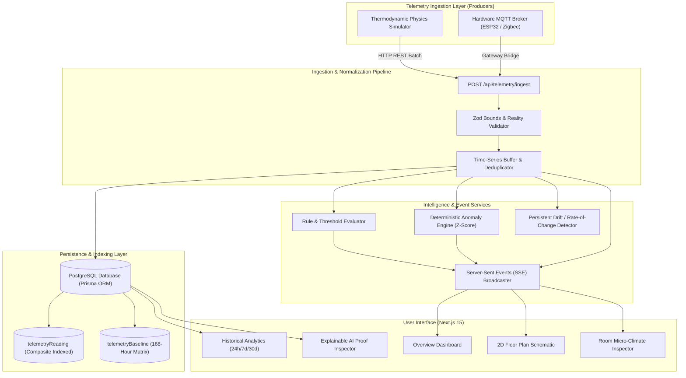

# Architecture & System Design

The **Home Intelligence Platform** is structured as an engineering telemetry and anomaly detection system. It models the home as a structured digital twin, decoupling telemetry production from consumption and analytics.

---

## 1. High-Level Architecture

---

## 2. Core Architectural Principles

### 1. "Understand the Home, Not Merely Control It"
Standard smart home systems focus purely on actuation (toggling switches, turning on lights). This platform treats the home as a thermodynamic, aerodynamic, and human-inhabited system. It tracks heat transfer across boundaries, air mass exchange, vampire power signatures, and occupant behavior patterns.

### 2. Strict Producer vs. Consumer Separation
The ingestion pipeline exposes a normalized, contract-guaranteed interface (`POST /api/telemetry/ingest`). The core application never knows or cares whether a reading was generated by the internal thermodynamic simulator or an external physical ESP32 broadcasting over MQTT. Swapping or augmenting the producer requires zero code alterations in the domain, persistence, or UI layers.

### 3. Realtime Reactive Push over Polling
Instead of continuous client-side HTTP polling which exhausts server sockets and causes database lock contention, the platform utilizes Server-Sent Events (SSE) via the Web Streams API. A single persistent connection receives:
- Instantaneous sensor updates (`telemetry_tick`)
- Hardware connectivity transitions (`health_changed`)
- Newly fired threshold events (`event_created`)
- Newly verified statistical insights (`insight_generated`)

### 4. No Hallucinatory AI
All intelligence is rooted in **transparent mathematics**:
- **Empirical Gaussian Baselines**: Partitioned by sensor, day of the week, and hour of the day (168 discrete distributions).
- **Parametric Z-Scores**: Deviation magnitude expressed as $Z = \frac{x - \mu}{\sigma}$.
- **Auditable Derivations**: Every insight displayed in the UI contains its underlying mathematical proof, exact timestamps, baseline parameters, and confidence metrics.
