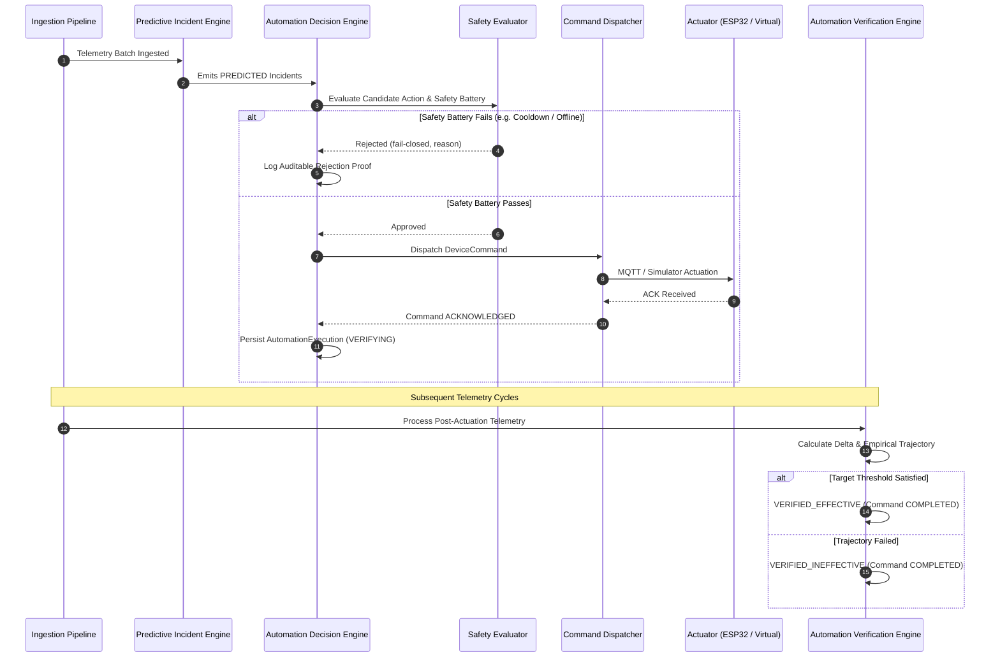

# Phase 7 Closed-Loop Intelligent Automation: Architectural & Engineering Guide

This document specifies the architecture, safety model, decision engine, execution pipeline, and empirical verification lifecycle of the **Closed-Loop Intelligent Automation Layer** in the Home Intelligence Platform.

---

## 1. System Evolution: Sense to Verify

The Home Intelligence Platform progresses across eight distinct, decoupled operational tiers, closing the loop from raw physical sensor observation to verified intervention:

```mermaid
flowchart LR
    A["1. SENSE\nPhysical / Simulated Telemetry"] --> B["2. DETECT\nSingle-Sensor Baselines & Z-Scores"]
    B --> C["3. CORRELATE\nCross-Sensor Incident Signatures"]
    C --> D["4. PREDICT\nStatistical & GBDT Forecasts"]
    D --> E["5. ANTICIPATE\nPredictive Incident Intelligence"]
    E --> F["6. DECIDE\nPolicy & Safety Evaluation Engine"]
    F --> G["7. ACT\nUnified Low-Voltage Actuator Dispatch"]
    G --> H["8. VERIFY\nEmpirical Closed-Loop Validation"]
```



| Operational Tier | Core Question | Primary Mechanism | State Classification |
| :--- | :--- | :--- | :--- |
| **1. Sense** | *What are physical transducers observing?* | ESP32 MQTT gateway, JSON payload normalization, virtual physics simulator | Telemetry Readings |
| **2. Detect** | *Is an individual sensor reading atypical?* | Historical mean/std-dev baselines, rolling Z-scores, threshold bounds | Anomaly Events |
| **3. Correlate** | *What coherent physical pattern is emerging?* | Spatiotemporal sliding windows, corroboration factor, rule engine | Incidents (`ACTIVE`) |
| **4. Predict** | *Where will continuous metrics land in 15m–24h?* | Seasonal diurnal decay, EMA, Gradient Boosted Trees (GBDT) | Metric Forecasts |
| **5. Anticipate** | *Will an incident breach limits before occurring?* | Multimodal CDF crossing probability, lead time estimation | Predictive Incidents (`PREDICTED`) |
| **6. Decide** | *Should the platform intervene automatically?* | Declarative policies, fail-closed safety checks, cooldown enforcement | Decision Candidate (`APPROVED` / `REJECTED`) |
| **7. Act** | *How is the intervention securely executed?* | Low-voltage relay/fan dispatch, idempotent command tracking, MQTT / virtual actuation | Device Command (`SENT` / `ACKNOWLEDGED`) |
| **8. Verify** | *Did the intervention achieve the physical goal?* | Post-actuation telemetry observation, trajectory delta calculation, latency audit | Execution (`VERIFIED_EFFECTIVE` / `INEFFECTIVE`) |

---

## 2. Core Architectural Principles

### 2.1 Predictions Do Not Actuate
A fundamental premise of the architecture is that **forecasts never directly invoke actuators**. Prediction engines emit probabilistic forecasts ($P(\text{breach})$, confidence interval, expected crossing time). An independent, decoupled **Automation Decision Engine** evaluates whether conditions justify action according to declarative user-configurable policies.

### 2.2 Strict Fail-Closed Safety Model
Every candidate action must survive an exhaustive battery of safety constraints in `SafetyEvaluator`. If any check fails, the system **fails closed**: no command is issued, and an explicit, auditable rejection reason is recorded.

```
+-------------------------------------------------------------------------+
|                         SAFETY EVALUATOR BATTERY                        |
+-------------------------------------------------------------------------+
  1. Policy Mode Check       --> Is policy enabled and set to AUTO? (MANUAL/DISABLED fail closed)
  2. Device Capability Check --> Is target device ONLINE and an exact actuator match?
  3. Electrical Safety Check --> Is device low-voltage only? (MAINS/HIGH_VOLTAGE rejected)
  4. Cooldown Period Check   --> Has policy cooldown window elapsed since last action?
  5. Rate Limit / Idempotency--> Are there zero pending/in-flight commands for this device?
+-------------------------------------------------------------------------+
            |                                         |
     All Checks Pass                           Any Check Fails
            |                                         |
            v                                         v
   APPROVE & DISPATCH                        REJECT & FAIL CLOSED
```

### 2.3 Strict Low-Voltage Scope (Safety by Design)
The platform strictly limits automated actuation to **low-voltage DC mechanisms**:
- Low-voltage relays ($5\text{V}$ / $12\text{V}$ / $24\text{V}$ DC auxiliary channels)
- Ventilation fans (PWM/relay speed stages)
- Cooling assist fans
- Visual indicator LEDs (status pulses)

> [!CAUTION]
> **Mains Voltage Prohibited**: Direct switching of 110V/230V AC mains circuits, breaker panels, or primary home HVAC compressor mains is strictly prohibited by both runtime software safety policies and device metadata validation.

### 2.4 Deterministic Explainability (Zero LLM Reasoning)
In keeping with platform standards, all decision justifications and audit records are generated through deterministic mathematical and rule-based derivations. No stochastic Large Language Model is involved in the control loop. Every execution stores an immutable explanation detailing:
- Triggering incident type and summary
- Forecast crossing value, threshold, and lead time
- Mathematical probability and confidence bounds
- Sensor corroboration (e.g. occupancy confirmation)
- Safety check audit results

---

## 3. Component Architecture & Interactions



---

## 4. Declarative Automation Policies

Policies are stored in the database (`AutomationPolicy`) and seeded with robust defaults:

| Policy Name | Trigger Condition | Target Metric | Min Prob / Conf | Cooldown | Actuator | Action | Parameters |
| :--- | :--- | :--- | :--- | :--- | :--- | :--- | :--- |
| **Ventilation CO₂ Predictive Control** | `PREDICTED_CO2_VENTILATION` | `ROOM_CO2` | $0.75$ / $0.70$ | $900\text{s}$ ($15\text{m}$) | `VENTILATION_FAN` | `TURN_ON` | Speed 2, 30m run, requires occupancy |
| **Thermal Influx & Backup Cooling** | `PREDICTED_AC_FAILURE` | `ROOM_TEMPERATURE` | $0.80$ / $0.75$ | $1200\text{s}$ ($20\text{m}$) | `VENTILATION_FAN` | `TURN_ON` | Speed 3, cooling mode, 60m run |
| **Peak Energy Surge Load Shedding** | `PREDICTED_ENERGY_SURGE` | `HOUSEHOLD_POWER` | $0.80$ / $0.75$ | $1800\text{s}$ ($30\text{m}$) | `LOW_VOLTAGE_RELAY` | `SHED_LOAD` | Channel 1, 800W shed target |
| **Thermal Breach Visual Warning** | `PREDICTED_THERMAL_BREACH` | `ROOM_TEMPERATURE` | $0.75$ / $0.70$ | $600\text{s}$ ($10\text{m}$) | `STATUS_LED` | `PULSE` | Amber, 2Hz blink, 5m run |

### Policy Operational Modes
1. **`AUTO`**: Automated decision engine continuously evaluates candidates and issues commands if safety checks pass.
2. **`MANUAL`**: Automated actuations are blocked (fail-closed). Operators may inspect recommendations and issue commands manually via the UI or API.
3. **`DISABLED`**: Policy is completely inactive; candidate evaluations are bypassed.

---

## 5. Closed-Loop Empirical Verification

Actuation is not the end of the automation cycle; it is the midpoint. An automated action remains in `VERIFYING` state until real telemetry confirms or refutes its physical efficacy.

### 5.1 Verification Mathematics
Given an execution initiated at timestamp $T_{\text{start}}$ with baseline metric value $M_{\text{base}}$ and target threshold $M_{\text{target}}$:
$$\Delta M = M_{\text{observed}}(T) - M_{\text{base}}$$

The verification criteria per target are:
- **CO₂ Ventilation**: Effective if $\Delta M \le -30\text{ ppm}$ or $M_{\text{observed}} < 1,000\text{ ppm}$ within 15 minutes.
- **Thermal Cooling Assist**: Effective if $\Delta M \le -0.3^\circ\text{C}$ or $M_{\text{observed}} \le M_{\text{target}}$ within 20 minutes.
- **Peak Load Shedding**: Effective if $\Delta M \le -300\text{ W}$ or $M_{\text{observed}} < M_{\text{target}}$ within 10 minutes.

### 5.2 Terminal Outcomes
- **`VERIFIED_EFFECTIVE`**: Telemetry confirmed expected physical response within observation window.
- **`VERIFIED_INEFFECTIVE`**: Telemetry failed to respond or drifted further out of bounds. The system identifies actuator insufficiency without flapping or sending rapid repeat commands.
- **`INCONCLUSIVE`**: Sensor telemetry ceased or timed out (>30 minutes) without fresh readings.

---

## 6. Resilience, Idempotency & Watchdog Integration

1. **Unique Idempotent Command IDs**: Every dispatch generates a cryptographically random, prefixed identifier (`cmd_<nanoid>`). Repeat requests with identical parameters while an in-flight command is active are suppressed.
2. **Command Lifetimes & Expiration**: Commands carry an explicit `expiresAt` timestamp. If unacknowledged within the timeout window, the command transitions to `TIMED_OUT` without retry loops.
3. **Physical Device State Awareness**: When the Phase 6 MQTT Watchdog transitions an ESP32 device to `STALE` or `OFFLINE`, the `SafetyEvaluator` immediately blocks all dispatch attempts targeting that device, preventing dead-node command queues.
