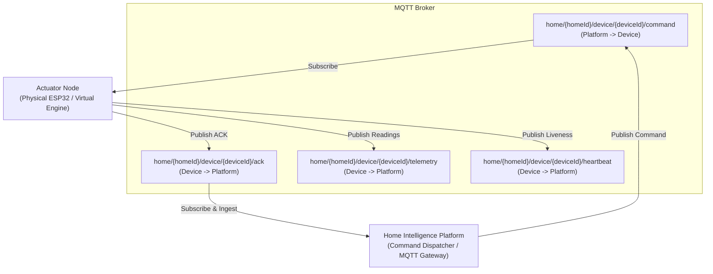
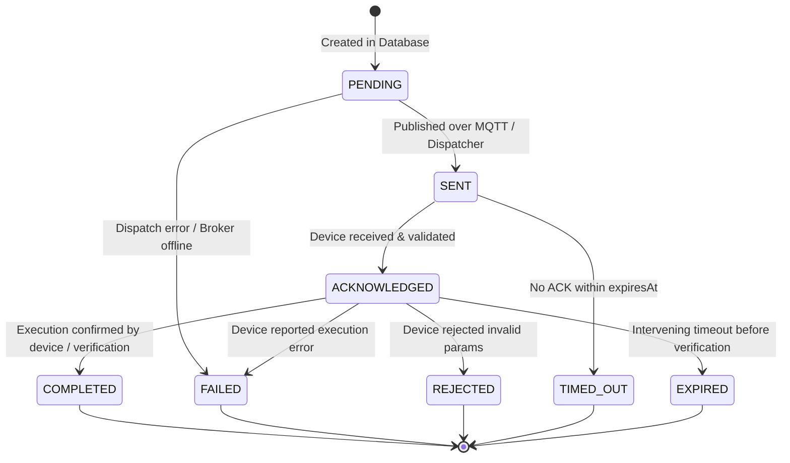

# Phase 7 Actuator Command & Acknowledgement Protocol Specification

This document details the wire contracts, MQTT topic hierarchy, JSON schemas, state machines, and firmware implementations governing device command dispatch and acknowledgement across the Home Intelligence Platform.

---

## 1. MQTT Topic Taxonomy

All command interactions utilize a strictly partitioned, tenant-isolated topic hierarchy matching the existing telemetry and heartbeat structure:

```
home/{homeId}/device/{deviceId}/{action}
```



| Channel | Topic Pattern | Direction | QoS | Purpose |
| :--- | :--- | :--- | :--- | :--- |
| **Command** | `home/{homeId}/device/{deviceId}/command` | Platform $\to$ Device | 1 | Dispatches structured operational instructions to an actuator |
| **Ack** | `home/{homeId}/device/{deviceId}/ack` | Device $\to$ Platform | 1 | Confirms physical receipt, acceptance, or failure of a command |
| **Telemetry** | `home/{homeId}/device/{deviceId}/telemetry` | Device $\to$ Platform | 0/1 | Transmits periodic physical sensor readings |
| **Heartbeat** | `home/{homeId}/device/{deviceId}/heartbeat` | Device $\to$ Platform | 0 | Proves node liveness for the 60s/180s watchdog |

---

## 2. Wire Contracts & JSON Schemas

### 2.1 Downstream Command Payload (`DeviceCommandPayload`)

Dispatched to `home/{homeId}/device/{deviceId}/command`:

```json
{
  "commandId": "cmd_mtx6qyk3_l1g6t5ca",
  "action": "TURN_ON",
  "issuedAt": "2026-09-11T22:15:30.000Z",
  "expiresAt": "2026-09-11T22:20:30.000Z",
  "source": "AUTOMATION_ENGINE",
  "parameters": {
    "speed": 2,
    "durationSec": 1800
  },
  "expectedState": {
    "action": "TURN_ON"
  }
}
```

#### TypeScript / Zod Contract (`src/domain/command.schema.ts`)
```ts
export const ActuatorActionEnum = z.enum([
  'TURN_ON',
  'TURN_OFF',
  'TOGGLE',
  'SET_SPEED',
  'SET_LEVEL',
  'PULSE',
  'SHED_LOAD',
  'RESTORE_LOAD',
]);

export const DeviceCommandPayloadSchema = z.object({
  commandId: z.string().min(8),
  action: ActuatorActionEnum,
  issuedAt: z.string().datetime(),
  expiresAt: z.string().datetime(),
  source: z.enum(['AUTOMATION_ENGINE', 'MANUAL_OVERRIDE']).default('AUTOMATION_ENGINE'),
  expectedState: z.record(z.any()).optional(),
  parameters: z.record(z.any()).optional(),
});
```

### 2.2 Upstream Acknowledgement Payload (`DeviceAckPayload`)

Published to `home/{homeId}/device/{deviceId}/ack`:

```json
{
  "commandId": "cmd_mtx6qyk3_l1g6t5ca",
  "status": "COMPLETED",
  "timestamp": "2026-09-11T22:15:30.045Z",
  "executionLatencyMs": 45.2,
  "resultingState": {
    "active": true,
    "action": "TURN_ON",
    "speed": 2
  }
}
```

#### TypeScript / Zod Contract (`src/domain/command.schema.ts`)
```ts
export const CommandStatusEnum = z.enum([
  'PENDING',
  'SENT',
  'ACKNOWLEDGED',
  'COMPLETED',
  'FAILED',
  'REJECTED',
  'TIMED_OUT',
  'EXPIRED',
]);

export const DeviceAckPayloadSchema = z.object({
  commandId: z.string().min(8),
  status: CommandStatusEnum,
  timestamp: z.string().datetime(),
  executionLatencyMs: z.number().nonnegative().optional(),
  resultingState: z.record(z.any()).optional(),
  errorMessage: z.string().optional(),
});
```

---

## 3. Command Lifecycle State Machine



### State Definitions
1. **`PENDING`**: Command formulated by `AutomationDecisionEngine` or manual user action and stored durably in PostgreSQL with a unique `commandId`.
2. **`SENT`**: Successfully published to the device's MQTT command topic.
3. **`ACKNOWLEDGED`**: Physical device or virtual simulator acknowledged receipt of the command.
4. **`COMPLETED`**: Physical actuation took effect, and verification engine observed the intervention lifecycle through to completion.
5. **`FAILED`**: Network delivery failed, or the hardware node reported an internal actuator hardware fault.
6. **`REJECTED`**: Hardware node refused command due to local constraint violations (e.g. invalid speed parameter).
7. **`TIMED_OUT`**: Device remained silent; command expired past `expiresAt`.

---

## 4. Idempotency & Duplicate Suppression

To prevent actuator flapping, relay chatter, and race conditions, the platform enforces strict idempotency at three independent stages:

1. **Active Command Deduplication**: Before issuing a command, `SafetyEvaluator` queries PostgreSQL for any commands for that device with the same action in `['PENDING', 'SENT', 'ACKNOWLEDGED']` where `expiresAt > NOW()`. If found, the new candidate is suppressed.
2. **Unique Ingestion Filtering**: The MQTT Gateway parses incoming `commandId`s and correlates them directly against open database records.
3. **Firmware Local Deduplication**: The ESP32 firmware caches the most recent `lastCommandId`. If a duplicate MQTT packet arrives with identical `commandId`, the firmware skips re-switching the GPIO pin and immediately re-emits the cached ACK.

---

## 5. Physical ESP32 Hardware Implementation

In `firmware/src/mqtt_manager.cpp`, the ESP32 subscribes to `home/{homeId}/device/{deviceId}/command` upon connecting to the broker:

```cpp
void MqttManager::handleIncomingCommand(char* topic, byte* payload, unsigned int length) {
  StaticJsonDocument<512> doc;
  DeserializationError err = deserializeJson(doc, payload, length);
  if (err) {
    Serial.println(F("[CMD] JSON parse failed"));
    return;
  }

  const char* commandId = doc["commandId"];
  const char* action = doc["action"];

  // Low-voltage GPIO switching (Pin 2 LED / Pin 4 Relay)
  bool success = false;
  if (strcmp(action, "TURN_ON") == 0 || strcmp(action, "SHED_LOAD") == 0) {
    digitalWrite(ACTUATOR_PIN, HIGH);
    success = true;
  } else if (strcmp(action, "TURN_OFF") == 0 || strcmp(action, "RESTORE_LOAD") == 0) {
    digitalWrite(ACTUATOR_PIN, LOW);
    success = true;
  } else if (strcmp(action, "PULSE") == 0) {
    digitalWrite(ACTUATOR_PIN, HIGH);
    delay(200);
    digitalWrite(ACTUATOR_PIN, LOW);
    success = true;
  }

  // Publish immediate upstream ACK
  StaticJsonDocument<256> ackDoc;
  ackDoc["commandId"] = commandId;
  ackDoc["status"] = success ? "COMPLETED" : "FAILED";
  ackDoc["timestamp"] = "2026-09-11T22:00:00Z";
  ackDoc["executionLatencyMs"] = 12.5;

  char ackBuffer[256];
  serializeJson(ackDoc, ackBuffer);
  mqttClient.publish(ackTopic, ackBuffer);
}
```

---

## 6. Electrical Safety Guarantees

1. **Metadata Enforcement**: Devices must declare `isActuator: true` and an explicit `actuatorType` (`VENTILATION_FAN`, `LOW_VOLTAGE_RELAY`, `STATUS_LED`).
2. **Mains-Voltage Prohibitions**: Any device with identifier or type containing `MAINS` or `HIGH_VOLTAGE` is permanently blocked by `SafetyEvaluator` and API route guards with a `403 Forbidden` error.
3. **Default Off on Boot**: Firmware configures all actuator GPIO pins as `OUTPUT` and pulls them `LOW` immediately during `setup()`, guaranteeing a safe de-energized state upon microcontroller reset or power loss.
