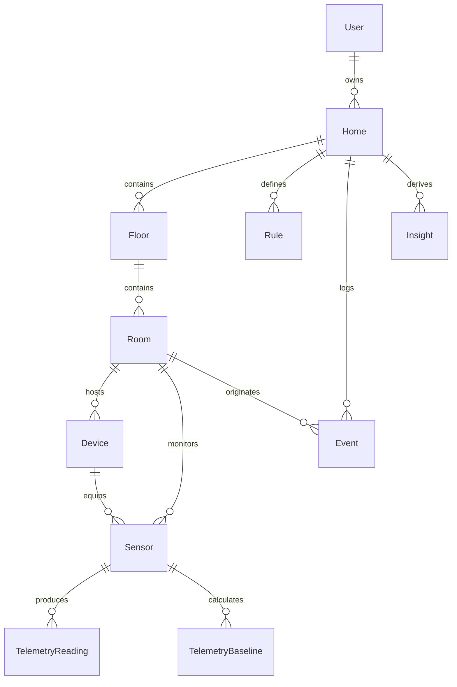

# Relational Data Model & Schema Specification

The **Home Intelligence Platform** relies on PostgreSQL with strict relational integrity, foreign key cascades, and high-performance time-series composite indexing.

---

## 1. Entity Hierarchy

---

## 2. Table Definitions & Roles

### `User`
- Multi-user and multi-tenant ready.
- Fields: `id`, `email`, `name`, `passwordHash`, `role` (`OWNER`, `ADMIN`, `MEMBER`, `VIEWER`).

### `Home`
- Central root entity for an estate or household.
- Fields: `id`, `name`, `timezone`, `address`, `ownerId`.

### `Floor`
- Physical building elevation level.
- Fields: `id`, `homeId`, `level` (e.g. 0 for Ground, 1 for Upper, -1 for Basement), `name`, `svgLayout` (bounding parameters).

### `Room`
- Spatial micro-climate envelope.
- Fields: `id`, `floorId`, `name`, `roomType` (`LIVING_ROOM`, `BEDROOM`, `KITCHEN`, `OFFICE`, `BATHROOM`), `targetTemp`, `layoutX`, `layoutY`, `layoutW`, `layoutH` (normalized 0-100 coordinates for 2D schematic).

### `Device`
- Physical or virtual appliance/hardware hub.
- Fields: `id`, `roomId`, `name`, `deviceType`, `protocol` (`SIMULATED`, `MQTT`, `ZIGBEE`, `MATTER`, `HTTP`), `identifier` (MAC, Serial, or MQTT Client ID), `status` (`ONLINE`, `DEGRADED`, `OFFLINE`), `firmwareVersion`, `lastSeenAt`.

### `Sensor`
- First-class sensing element with units, sampling rate, and health tracking.
- Fields: `id`, `roomId`, `deviceId`, `type` (`TEMPERATURE`, `HUMIDITY`, `CO2`, `PM2_5`, `POWER`, `OCCUPANCY`, `LIGHT`, `NOISE`), `unit`, `samplingIntervalSec`, `minExpectedValue`, `maxExpectedValue`, `lastReadingValue`, `lastReadingTime`, `health` (`HEALTHY`, `STALE`, `FAULTY`, `OFFLINE`).

### `TelemetryReading`
- High-frequency time-series partitionable table.
- Composite Indexes:
  - `(sensorId, timestamp DESC)` for sensor micro-sparklines and ranges.
  - `(timestamp DESC)` for fleet-wide downsampling queries.
- Fields: `id`, `sensorId`, `timestamp`, `value`, `quality` (`VALID`, `DEGRADED`, `INTERPOLATED`).

### `TelemetryBaseline`
- 168-hour empirical Gaussian distribution matrix per sensor.
- Unique Index: `(sensorId, dayOfWeek, hourOfDay)`
- Fields: `sensorId`, `dayOfWeek` (0-6), `hourOfDay` (0-23), `mean`, `stdDev`, `sampleCount`.

### `Rule` & `Event`
- Structured declarative evaluation rules and immutable audit log.
- Fields: `severity` (`INFO`, `WARNING`, `ERROR`, `CRITICAL`), `category`, `contextData` (JSONB with actual vs threshold values), `status` (`ACTIVE`, `ACKNOWLEDGED`, `RESOLVED`).

### `Insight`
- Auditable AI and deterministic intelligence outputs.
- Fields: `type` (`ANOMALY`, `EFFICIENCY`, `CORRELATION`), `confidence` (0.00-1.00), `isHeuristic`, `explanation`, `evidenceData` (JSONB containing $x, \mu, \sigma, Z, \Delta$).
