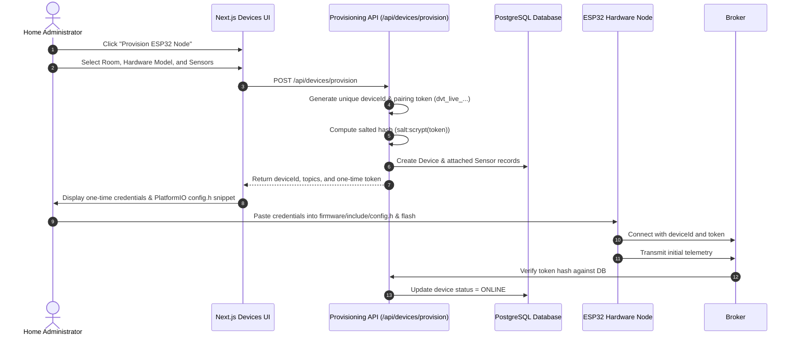

# Phase 6 Device Provisioning & Security Lifecycle Guide

This guide details the end-to-end security lifecycle for registering, provisioning, configuring, rotating credentials, and revoking physical **ESP32/ESP8266** devices in the Home Intelligence Platform.

---

## 1. Security Architecture & Threat Model

The platform treats MQTT as an untrusted boundary:

1. **No Shared Root Secrets**: Each physical hardware node receives a distinct, randomly generated device pairing token (`dvt_live_<random_bytes>`).
2. **One-Way Salted Hashes in Database**: The raw pairing token is **never stored in plaintext** in PostgreSQL. The backend stores exclusively `<saltHex>:<scryptHashHex>`.
3. **Tenant & Boundary Enclosure**: Topic authorization checks verify that incoming messages from `device A` cannot impersonate `device B` or broadcast into another household's namespace.
4. **Immediate Revocation**: Revoking a device in the UI immediately wipes its authentication credentials, drops the broker socket, and blocks all future telemetry packets.

---

## 2. Provisioning Workflow



---

## 3. Provisioning REST API Reference

### `POST /api/devices/provision`
Registers a new physical microcontroller and creates its associated database sensors.

#### Request Body
```json
{
  "homeId": "cmtvouk5w0002k6dgq9u5mwye",
  "roomId": "cmtvouk61000ak6dgrjm5n5ud",
  "name": "Master Bedroom Climate Hub",
  "deviceType": "ENVIRONMENTAL_HUB",
  "hardwareType": "ESP32_WROOM_32",
  "macAddress": "24:6F:28:AB:CD:EF",
  "sensorTypes": ["TEMPERATURE", "HUMIDITY", "CO2", "OCCUPANCY", "CONTACT"]
}
```

#### Response Body (201 Created)
```json
{
  "device": {
    "id": "cmtx01...",
    "identifier": "esp32-master_bedroom-a7b2c",
    "name": "Master Bedroom Climate Hub",
    "homeId": "cmtvouk5w0002k6dgq9u5mwye",
    "roomId": "cmtvouk61000ak6dgrjm5n5ud",
    "hardwareType": "ESP32_WROOM_32",
    "protocol": "MQTT",
    "provisioningStatus": "PROVISIONED"
  },
  "credentials": {
    "topicPrefix": "home/cmtvouk5w0002k6dgq9u5mwye/device/esp32-master_bedroom-a7b2c",
    "telemetryTopic": "home/cmtvouk5w0002k6dgq9u5mwye/device/esp32-master_bedroom-a7b2c/telemetry",
    "statusTopic": "home/cmtvouk5w0002k6dgq9u5mwye/device/esp32-master_bedroom-a7b2c/status",
    "commandTopic": "home/cmtvouk5w0002k6dgq9u5mwye/device/esp32-master_bedroom-a7b2c/command",
    "deviceId": "esp32-master_bedroom-a7b2c",
    "authToken": "dvt_live_7a8f9c1b3d5e7f9a1b3c5d7e9f1a3b5c7d9e1f3a"
  },
  "configSnippet": "// C++ config.h code block ready for PlatformIO"
}
```

---

## 4. Device Revocation & De-Commissioning

To decommission or permanently disconnect a compromised physical device:

### `POST /api/devices/[id]/revoke`
- Verifies administrative home ownership.
- Updates `provisioningStatus` to `REVOKED`.
- Sets device status to `OFFLINE`.
- Sets `authTokenHash` to `null`, invalidating all existing device tokens.
- Updates all attached sensors to `SensorHealth.OFFLINE`.

```bash
curl -X POST http://localhost:3000/api/devices/cmtx01.../revoke \
  -H "Authorization: Bearer <ADMIN_SESSION_COOKIE>"
```
