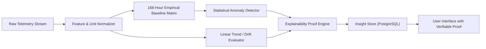

# AI & Deterministic Intelligence Layer

The **Home Intelligence Platform** implements a deterministic, mathematically transparent analytics and anomaly-detection engine. It strictly avoids decorative AI text and fabricated confidence scores.

---

## 1. Intelligence Pipeline Architecture

---

## 2. Empirical Baseline Modeling

Indoor residential telemetry exhibits strong diurnal (time-of-day) and cyclical (workday vs weekend) patterns. A single global average is scientifically useless (e.g. 500W at 2 AM is an alarming power surge, whereas 500W at 8 PM is normal dinner preparation).

### The 168-Hour Matrix
For every sensor, the platform computes and updates historical distributions partitioned by:
- **Day of the Week**: $d \in \{0, 1, 2, 3, 4, 5, 6\}$ (Sunday through Saturday)
- **Hour of the Day**: $h \in \{0, 1, 2, \dots, 23\}$

Over a rolling 14-day history, each $(d, h)$ bucket contains $n \ge 10$ historical samples.

### Parametric Formulations
For each bucket:

$$\mu_{d,h} = \frac{1}{n} \sum_{i=1}^n x_i$$

$$\sigma_{d,h} = \sqrt{\frac{1}{n} \sum_{i=1}^n (x_i - \mu_{d,h})^2}$$

To avoid division by zero in tightly regulated environments (e.g. constant temperature), a floor $\sigma_{min} = 0.1$ is enforced.

---

## 3. Anomaly Detection & Statistical Scoring

### Standard Score (Z-Score)
When a new reading $x_t$ arrives at timestamp $t$:
$$Z = \frac{x_t - \mu_{d,h}}{\sigma_{d,h}}$$

### Anomaly Thresholds & P-Values
Under normal Gaussian assumptions:
- $|Z| < 2.0$: **Normal** (within 95.4% expected range).
- $2.0 \le |Z| < 2.5$: **Elevated / Advisory** (within 98.7% expected range).
- $2.5 \le |Z| < 3.5$: **Statistical Anomaly** ($p < 0.012$) $\to$ Triggers `WARNING` or `ERROR`.
- $|Z| \ge 3.5$ or $|\Delta| \ge 80\%$: **Severe Anomaly** ($p < 0.0004$) $\to$ Triggers `CRITICAL`.

### Mathematically Grounded Confidence
Confidence is derived strictly from the statistical distance:
$$\text{Confidence} = \min\left(0.99, 0.50 + \frac{|Z|}{5.0} \times 0.49\right)$$
If an insight is derived from a heuristic rule rather than parametric statistics, it is explicitly flagged with `isHeuristic: true`.

---

## 4. Persistent Drift & Dynamic Rate of Change

For non-instantaneous failures (such as a bedroom door closed overnight causing progressive asphyxiation/CO2 accumulation or a failing HVAC heat pump), the platform computes the linear regression slope over sliding windows ($M = 30\text{ min}$):

$$\text{Slope} = \frac{n \sum (t_i y_i) - \left(\sum t_i\right)\left(\sum y_i\right)}{n \sum t_i^2 - \left(\sum t_i\right)^2}$$

- **Ventilation Deficiency**: If $\text{Slope}_{\text{CO}_2} > +12\,\text{ppm/min}$ for $> 30\,\text{min}$ while $\text{Occupancy} == \text{True}$, an insight is triggered explaining the air turnover failure.

---

## 5. Explainability Guarantee in the UI

Every insight card in the UI displays:
1. **Current Observed Value** ($x$)
2. **Historical Baseline Mean** ($\mu$) for the exact day and hour
3. **Historical Standard Deviation** ($\sigma$)
4. **Calculated Z-Score** ($Z$)
5. **Percentage Deviation** ($\Delta = \frac{x - \mu}{\mu} \times 100\%$)
6. **Sample Count** ($n$)
