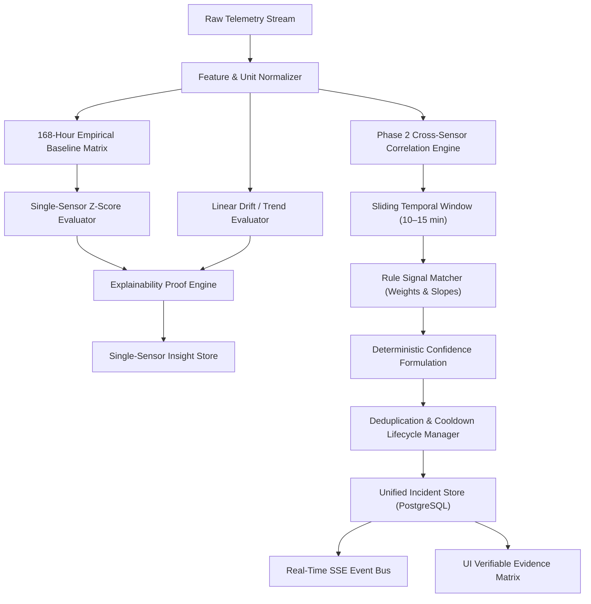
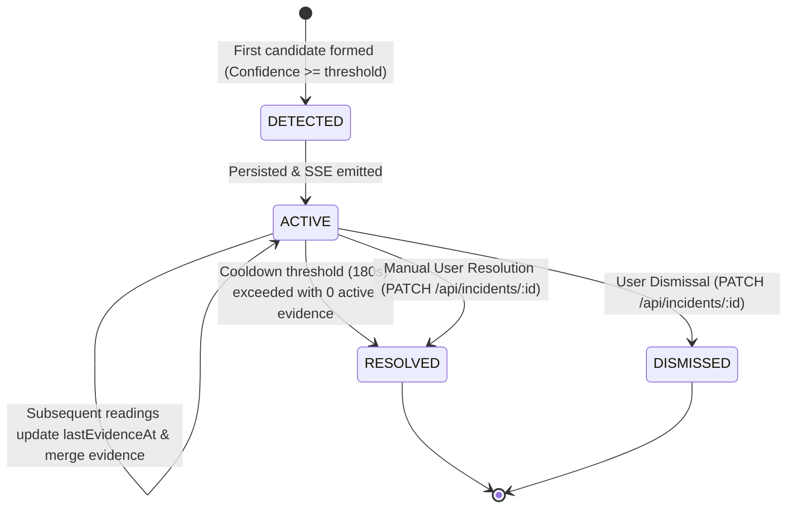
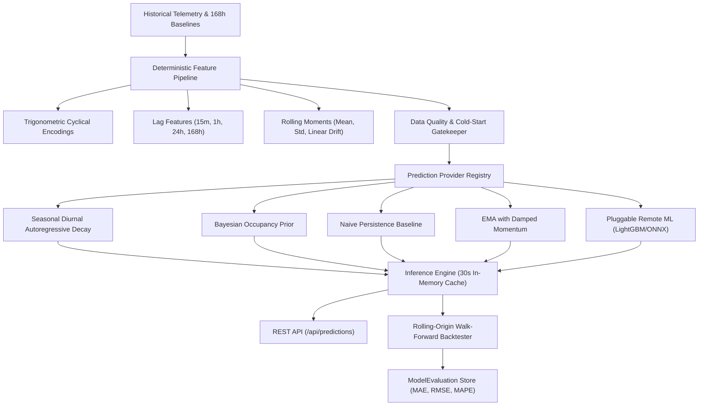

# AI & Deterministic Intelligence Layer

The **Home Intelligence Platform** implements a deterministic, mathematically transparent analytics and anomaly-detection engine. It strictly avoids decorative AI text and fabricated confidence scores.

---

## 1. Intelligence Pipeline Architecture

---

## 2. Empirical Baseline Modeling (Single Sensor)

Indoor residential telemetry exhibits strong diurnal (time-of-day) and cyclical (workday vs weekend) patterns. A single global average is scientifically useless (e.g. 500W at 2 AM is an alarming power surge, whereas 500W at 8 PM is normal dinner preparation).

### The 168-Hour Matrix
For every sensor, the platform computes and updates historical distributions partitioned by:
- **Day of the Week**: $d \in \{0, 1, 2, 3, 4, 5, 6\}$ (Sunday through Saturday)
- **Hour of the Day**: $h \in \{0, 1, 2, \dots, 23\}$

Over a rolling 14-day history, each $(d, h)$ bucket contains $n \ge 10$ historical samples.

### Parametric Formulations
For each bucket:

$$\mu_{d,h} = \frac{1}{n} \sum_{i=1}^n x_i$$

$$\sigma_{d,h} = \sqrt{\frac{1}{n} \sum_{i=1}^n (x_i - \mu_{d,h})^2}$$

To avoid division by zero in tightly regulated environments (e.g. constant temperature), a scale floor is enforced based on sensor physics:
- Temperature: $\sigma_{min} = 0.20$
- Humidity: $\sigma_{min} = 0.50$
- Power: $\sigma_{min} = 5.0$
- CO2: $\sigma_{min} = 15.0$
- Water Flow: $\sigma_{min} = 0.20$
- Contact: $\sigma_{min} = 0.10$

---

## 3. Anomaly Detection & Statistical Scoring

### Standard Score (Z-Score)
When a new reading $x_t$ arrives at timestamp $t$:
$$Z = \frac{x_t - \mu_{d,h}}{\sigma_{d,h}}$$

### Anomaly Thresholds & P-Values
Under normal Gaussian assumptions:
- $|Z| < 2.0$: **Normal** (within 95.4% expected range).
- $2.0 \le |Z| < 2.5$: **Elevated / Advisory** (within 98.7% expected range).
- $2.5 \le |Z| < 3.5$: **Statistical Anomaly** ($p < 0.012$) $\to$ Triggers `WARNING` or `ERROR`.
- $|Z| \ge 3.5$ or $|\Delta| \ge 80\%$: **Severe Anomaly** ($p < 0.0004$) $\to$ Triggers `CRITICAL`.

### Single-Sensor Confidence Formulation
Confidence is derived strictly from the statistical distance:
$$\text{Confidence} = \min\left(0.99, 0.50 + \frac{|Z|}{5.0} \times 0.49\right)$$

---

## 4. Phase 2 Cross-Sensor Correlation Formulation

Rather than evaluating telemetry streams independently, the **Cross-Sensor Correlation Engine** synthesizes synchronous observations across independent physical sensors within sliding temporal envelopes ($W \in [600s, 900s]$).

### Mathematical Incident Confidence

Confidence is never invented or generated via non-deterministic LLM prompting. It is computed via closed-form evidence weighting and channel corroboration:

#### Step 1: Raw Evidence Confidence
Every rule signal condition $i$ carries a configured physical weight $w_i \in (0, 1]$ where $\sum_{j \in \text{All}} w_j = 1.0$:

$$\text{RawConfidence} = \frac{\sum_{i \in \text{Satisfied}} w_i}{\sum_{j \in \text{All}} w_j}$$

#### Step 2: Distinct Physical Channel Corroboration Factor
To prevent sensor redundancy (e.g. multiple signals deriving from a single combined sensor) from artificially inflating certainty, the system counts $N_{\text{distinct\_sensors}}$, representing unique physical sensing channels confirming the incident:

$$\text{CorroborationFactor} = \min\left(1.0, 0.70 + 0.10 \times \max(0, N_{\text{distinct\_sensors}} - 1)\right)$$

- $N = 1$ distinct sensor: $\text{CorroborationFactor} = 0.70$
- $N = 2$ distinct sensors: $\text{CorroborationFactor} = 0.80$
- $N = 3$ distinct sensors: $\text{CorroborationFactor} = 0.90$
- $N \ge 4$ distinct sensors: $\text{CorroborationFactor} = 1.00$

#### Step 3: Final Incident Confidence
$$\text{FinalConfidence} = \min\left(0.99, \text{RawConfidence} \times \text{CorroborationFactor}\right)$$

A strict upper ceiling of $0.99$ is enforced: empirical physical systems never assert 100.0% certainty.

---

## 5. Standard Correlation Rules & Signatures

### 1. Culinary Activity & Thermal Load (`COOKING_EVENT`)
- **Required Signals**: Kitchen Occupancy ($w = 0.25$, condition: `VALUE_EQ == 1`)
- **Corroborating Signals**:
  - Appliance / Cooktop Power Draw ($w = 0.30$, condition: `VALUE_GT > 600 W`)
  - Thermal Plume Rise ($w = 0.25$, condition: `RATE_OF_CHANGE_GT > 0.05 °C/min`)
  - Aerosol / PM2.5 Elevation ($w = 0.20$, condition: `VALUE_GT > 20 µg/m³`)
- **Window**: 15 minutes (900 seconds)
- **Minimum Confidence**: $0.70$

### 2. Unmonitored Moisture & Continuous Flow (`WATER_LEAK`)
- **Required Signals**: Absence of Occupancy ($w = 0.35$, condition: `VALUE_EQ == 0`)
- **Corroborating Signals**:
  - Continuous Water Flow ($w = 0.40$, condition: `VALUE_GT > 0.5 L/min`)
  - Moisture Saturation ($w = 0.25$, condition: `VALUE_GT > 82.0 % RH`)
- **Severity**: `CRITICAL`
- **Window**: 10 minutes (600 seconds)
- **Minimum Confidence**: $0.70$

### 3. Climate System Cooling Inefficiency (`AC_FAILURE`)
- **Required Signals**:
  - HVAC Electrical Power Consumption ($w = 0.35$, condition: `VALUE_GT > 500 W`)
  - Upward Temperature Departure ($w = 0.45$, condition: `RATE_OF_CHANGE_GT > 0.04 °C/min`)
- **Corroborating Signals**:
  - Occupant Presence ($w = 0.20$, condition: `VALUE_EQ == 1`)
- **Severity**: `ERROR`
- **Window**: 15 minutes (900 seconds)
- **Minimum Confidence**: $0.75$

### 4. Thermal Envelope Breach (`WINDOW_THERMAL_EVENT`)
- **Corroborating Signals**:
  - Window Contact Sensor Open ($w = 0.35$, condition: `VALUE_EQ == 1`)
  - Rapid Thermal Departure ($w = 0.40$, condition: `RATE_OF_CHANGE_LT < -0.10 °C/min`)
  - HVAC Energy Compensation ($w = 0.25$, condition: `VALUE_GT > 400 W`)
- **Severity**: `WARNING`
- **Window**: 10 minutes (600 seconds)
- **Minimum Confidence**: $0.70$

---

## 6. Incident Lifecycle & Deduplication State Machine

1. **Deduplication Suppression**: When a continuous event (e.g. 45-minute cooking session) generates repeating candidates in consecutive ticks, the engine queries for existing active incidents matching `(homeId, roomId, incidentType)`. Instead of polluting the table with duplicate rows, it updates `lastEvidenceAt`, merges evidence, and updates confidence.
2. **Auto-Resolution Cooldown**: If evidence ceases for $> 180\,\text{seconds}$, the engine automatically transitions the incident to `RESOLVED` and emits an `incident_resolved` event.

---

## 7. Predictive Home Intelligence (Phase 3)

Phase 3 transitions the platform from reactive correlation to multi-horizon predictive intelligence:
$$\text{Observe} \longrightarrow \text{Detect} \longrightarrow \text{Correlate} \longrightarrow \text{Predict}$$

All statistical baselines adhere strictly to deterministic mathematical formulations without LLMs or heuristic buzzwords.

### 7.1 Mathematical Formulations

#### 1. Seasonal Diurnal with Autoregressive Residual Decay (`STATISTICAL_SEASONAL_DECAY`)
For continuous environmental and energy signals (`ROOM_TEMPERATURE`, `ROOM_CO2`, `HOUSEHOLD_POWER`), short-term fluctuations depart from the diurnal pattern due to sudden thermal or metabolic events. The predictor anchors on the real-time residual at $h \to 0$ and relaxes smoothly toward the 168-hour diurnal baseline expectation as $h$ grows:

$$\hat{y}_{t+h} = \mu_{d(t+h), h(t+h)} + e^{-\lambda h} \left(y_t - \mu_{d(t), h(t)}\right)$$

where:
- $\mu_{d, h}$ is the historical mean for that specific day-of-week $d$ and hour-of-day $h$ from `TelemetryBaseline`.
- $\lambda = \frac{\ln(2)}{t_{1/2}}$ is the residual autocorrelation decay parameter.
- $t_{1/2}$ is calibrated from physical dynamics: $90\text{ min}$ for room temperature (building thermal inertia), $45\text{ min}$ for CO2 (air dissipation), and $20\text{ min}$ for active power.

**Prediction Interval Blending**:
Uncertainty smoothly expands from short-term residual variance $\sigma_{\text{recent}}^2$ to full diurnal variation $\sigma_{\text{baseline}}^2$:
$$\sigma_{\text{pred}}(h) = \sqrt{e^{-\lambda h} \sigma_{\text{recent}}^2 + (1 - e^{-\lambda h}) \sigma_{\text{baseline}}^2(d_{t+h}, h_{t+h})}$$
- $80\%\text{ CI} = \left[\hat{y} - 1.282 \sigma_{\text{pred}},\, \hat{y} + 1.282 \sigma_{\text{pred}}\right]$
- $95\%\text{ CI} = \left[\hat{y} - 1.960 \sigma_{\text{pred}},\, \hat{y} + 1.960 \sigma_{\text{pred}}\right]$

#### 2. Naive Persistence Baseline (`STATISTICAL_PERSISTENCE`)
Serves as the zero-intelligence benchmark:
$$\hat{y}_{t+h} = y_t$$
Uncertainty monotonically expands with horizon: $\sigma_h = \sigma_{\text{base}} \sqrt{\max(1, h / 15)}$.

#### 3. EMA with Damped Momentum (`STATISTICAL_EMA`)
Linearly extrapolates recent trend from linear regression slope $\beta$ over the preceding hour, damped exponentially over a relaxation window:
$$\hat{y}_{t+h} = \bar{y}_{15m} + h \cdot \beta \cdot e^{-\gamma h}$$
where $\gamma = 0.03$ ensures momentum does not diverge into unphysical extremes.

#### 4. Bayesian Occupancy Prior with Motion Decay (`BAYESIAN_OCCUPANCY`)
Predicts discrete Bernoulli occupancy probability $p \in [0.0, 1.0]$.
At $h = 0$, anchors on binary PIR motion state ($y_t \in \{0, 1\}$). As time elapses without renewed motion, probability relaxes exponentially toward the historical diurnal habit prior $P_{\text{base}}(d, h)$:

$$P(t+h) = P_{\text{base}}(d_{t+h}, h_{t+h}) + e^{-\kappa h} \left(y_t - P_{\text{base}}(d_t, h_t)\right)$$

where $\kappa = \frac{\ln(2)}{30}$ if currently occupied (30m vacancy half-life) or $\frac{\ln(2)}{15}$ if vacant.
Standard error of the Bernoulli estimate is derived directly from empirical probability:
$$\text{SE}(p) = \sqrt{p(1 - p)}$$

### 7.2 Pluggable Machine Learning Adapter (`REMOTE_MICROSERVICE`)
The platform exposes an `IPredictionProvider` contract enabling external microservices (e.g., Python LightGBM or ONNX runtime) to serve inferences via standard JSON HTTP requests.
- **Contract**: `RemotePredictionRequestSchema` (target, cyclical features, lags, rolling moments, context).
- **Circuit Breaker**: 800ms SLA timeout with automatic, silent fallback to `STATISTICAL_SEASONAL_DECAY` or `BAYESIAN_OCCUPANCY`.

### 7.3 Rolling-Origin Walk-Forward Backtesting Evaluation
Evaluation avoids random data splitting to prevent lookahead bias.
- The continuous evaluator slides origin timestamps $t_k$ forward in 6-hour steps across the test window (e.g. 7 or 14 days).
- Inferences are computed using only data $\le t_k$, and compared against actual ground truth at $t_k + 15\text{m}$, $t_k + 1\text{h}$, $t_k + 4\text{h}$, and $t_k + 24\text{h}$.
- Quantified metrics:
  - $\text{MAE} = \frac{1}{N} \sum |y - \hat{y}|$
  - $\text{RMSE} = \sqrt{\frac{1}{N} \sum (y - \hat{y})^2}$
  - $\text{MAPE} = \frac{100\%}{N} \sum \frac{|y - \hat{y}|}{|y|}$
  - Horizon degradation curve and inference latency in milliseconds.
- Results are persisted to the PostgreSQL `ModelEvaluation` table.

