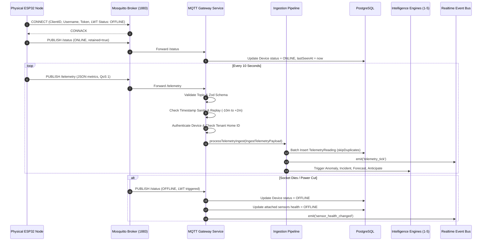
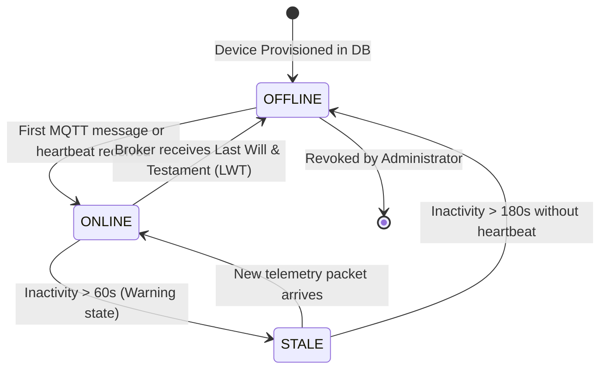

# Phase 6 IoT Architecture: Physical Microcontrollers to Intelligent Household Automation

This document specifies the technical architecture, communication boundaries, state machines, and failover mechanics connecting physical **ESP32/ESP8266** hardware nodes to the **Home Intelligence Platform**.

---

## 1. Architectural Principles & Boundaries

The integration of physical IoT devices adheres to four non-negotiable architectural axioms:

1. **Strict Separation of Producer and Consumer**:
   - The physical microcontroller operates solely as a **telemetry producer**.
   - It performs hardware abstraction, periodic sensor sampling, timestamp acquisition via SNTP, and JSON serialization over MQTT.
   - The microcontroller contains **zero duplicate intelligence or anomaly logic**.
2. **Single Authoritative Telemetry Ingestion Gateway**:
   - All physical MQTT telemetry is decoded, authenticated, and mapped by the gateway into the platform's normalized `IngestTelemetryPayload`.
   - The telemetry is processed exclusively by the existing, authoritative [`processTelemetryIngest`](file:///c:/Users/AADEESH/OneDrive/Desktop/Home%20Intelligence%20Platform/src/server/telemetry/pipeline.ts) pipeline.
   - The platform avoids duplicate validation pipelines.
3. **Coexistence of Physical and Simulated Fleets**:
   - A single home can host both physical ESP32 devices (`protocol === 'MQTT'`) and virtual digital twin devices (`protocol === 'SIMULATED'`).
   - The physics simulator automatically detects physical devices and leaves their sensors exclusively to real telemetry, preventing synthetic values from overriding physical truth.
4. **Resilient Offline Diagnostics without Zero-Fabrication**:
   - When a sensor stops transmitting, the platform records `SensorHealth.STALE` or `SensorHealth.OFFLINE`.
   - The system **never fabricates zero-valued telemetry** ($0^\circ\text{C}$ or $0\text{ ppm}$), preserving historical baseline and forecasting fidelity.

---

## 2. End-to-End Ingestion Flow

---

## 3. Hardware Architecture: ESP32 DevKit v1 Prototype

The first hardware milestone standardizes on the **ESP32-WROOM-32** dual-core 240 MHz microcontroller.

### 3.1. Sensor Subsystem Pin Assignments
- **GPIO 4**: DHT22 Digital Temperature & Humidity ($10\text{ k}\Omega$ pull-up).
- **GPIO 34**: MQ-135 Gas / $\text{CO}_2$ proxy (ADC1 Channel 6, input only).
- **GPIO 18**: HC-SR501 PIR Motion detector (Active HIGH).
- **GPIO 19**: Magnetic Reed Switch for window/door contact (Internal `INPUT_PULLUP`).
- **GPIO 2**: Onboard status LED (Solid blue when Wi-Fi and MQTT connected).

### 3.2. Power Architecture & Electrical Isolation
The prototype operates from a regulated 5V USB connection or a dedicated 3.3V/5V breadboard power supply module. 
- Low-voltage DC operation ensures complete galvanic isolation.
- Mains AC ($120\text{V}/240\text{V}$) experimentation is strictly disallowed in this milestone.

---

## 4. Operational Device State Machine

The gateway maintains a three-state operational model for physical hardware nodes:

| State | Inactivity Window | Indicator | Impact on Intelligence |
| :--- | :--- | :--- | :--- |
| **`ONLINE`** | $< 60\text{ seconds}$ | Green Pulse | Active continuous evaluation across all intelligence tiers. |
| **`STALE`** | $60\text{--}180\text{ seconds}$ | Amber Warning | Forecasts switch to decaying mode; confidence score penalized. |
| **`OFFLINE`** | $> 180\text{ seconds}$ or LWT | Red Dot | Sensors marked `OFFLINE`. Telemetry not ingested. No false zeros. |

---

## 5. Security & Tenant Isolation

1. **Strict Topic Authorization**:
   - A device identified as `esp32-livingroom-01` in home `home_xyz` can **only** publish to:
     `home/home_xyz/device/esp32-livingroom-01/#`
   - Any packet published to a differing home or device ID is rejected and logged as an authorization violation.
2. **Replay & Clock Skew Protection**:
   - The gateway validates that the incoming packet's timestamp lies within $[-10\text{ min}, +2\text{ min}]$ of the server clock.
   - Out-of-order historical packets are persisted for analytical history without overwriting live sensor state.
3. **One-Time Provisioning Secrets**:
   - Device pairing tokens (`dvt_live_<random_bytes>`) are displayed only once in the frontend.
   - Only the salted cryptographic hash (`<salt>:<hash>`) is persisted in PostgreSQL.
