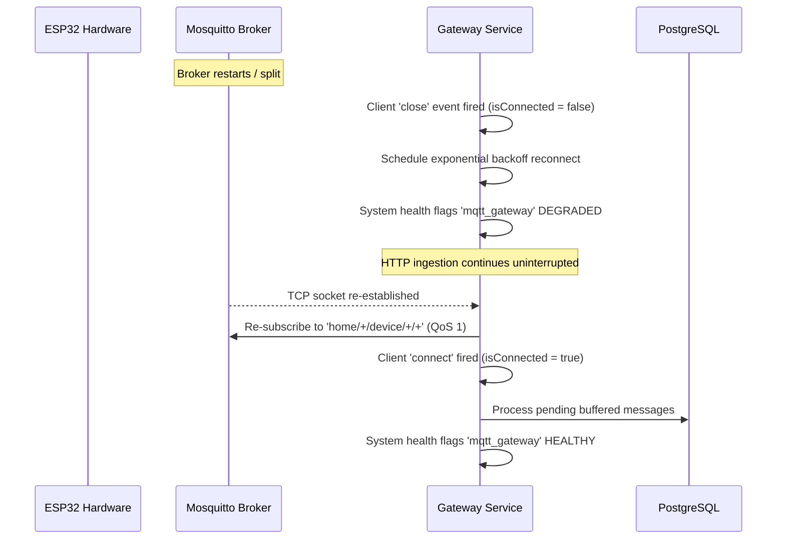

# Production Operations Manual

This document provides runbooks, disaster recovery procedures, secret rotation guidelines, and operational playbooks for maintaining the **Home Intelligence Platform** in production.

---

## 1. Health & Probes Architecture

The platform exposes three decoupled probe endpoints for container orchestrators (Kubernetes, Docker Swarm, AWS ECS, Cloud Run):

| Endpoint | Purpose | Target Audience | HTTP Status Codes |
| :--- | :--- | :--- | :--- |
| `GET /api/live` | **Liveness Probe**: Confirms process event loop is active | Orchestrator process monitor | `200 OK` |
| `GET /api/ready` | **Readiness Probe**: Confirms mandatory dependencies (PostgreSQL) are operational | Load balancer traffic ingress | `200 OK` (Ready)<br>`503 Service Unavailable` (Down) |
| `GET /api/health` | **Operator Diagnostics**: Detailed breakdown of 6 core subsystems | DevOps / Engineering dashboards | `200 OK` (Healthy / Degraded)<br>`503 Service Unavailable` (Critical) |

### Sample Probe Responses

#### 1. Liveness (`/api/live`)
```json
{
  "status": "ALIVE",
  "uptimeSeconds": 14520,
  "timestamp": "2026-09-12T01:30:00.000Z"
}
```

#### 2. Readiness (`/api/ready`)
```json
{
  "status": "READY",
  "dependencies": {
    "database": {
      "status": "UP",
      "latencyMs": 2.4
    }
  },
  "timestamp": "2026-09-12T01:30:00.000Z"
}
```

---

## 2. Database Backup & Restore Procedures

### A. Creating a Production Database Backup

#### Local or Direct Host:
```bash
# Export compressed binary custom-format dump with timestamps
pg_dump -h localhost -p 5432 -U postgres -d home_intelligence -Fc \
  -f "backups/home_intelligence_$(date +%Y%m%d_%H%M%S).dump"
```

#### Inside Docker Stack:
```bash
# Execute pg_dump within running container
docker exec -t home_intelligence_prod_db pg_dump -U postgres -d home_intelligence -Fc \
  > "backups/home_intelligence_prod_$(date +%Y%m%d_%H%M%S).dump"
```

### B. Restoring Database from Backup

#### Local or Direct Host:
```bash
# 1. Terminate existing connections (if necessary)
psql -U postgres -c "SELECT pg_terminate_backend(pid) FROM pg_stat_activity WHERE datname = 'home_intelligence' AND pid <> pg_backend_pid();"

# 2. Restore with clean schema drops and transaction integrity
pg_restore -h localhost -p 5432 -U postgres -d home_intelligence --clean --if-exists --no-owner \
  "backups/home_intelligence_20260912_000000.dump"
```

#### Inside Docker Stack:
```bash
# Stream dump into container pg_restore
cat "backups/home_intelligence_prod_20260912_000000.dump" | \
  docker exec -i home_intelligence_prod_db pg_restore -U postgres -d home_intelligence --clean --if-exists --no-owner
```

---

## 3. Database Migration Deployment Runbook

The platform strictly differentiates development prototyping (`prisma db push`) from production migration execution:

### Production Migration Deployment
```bash
# Applies all pending, committed migrations without prompting
npm run db:migrate
# (Equivalent to: npx prisma migrate deploy)
```

### Development Migration Generation
```bash
# In local development when schema changes are made
npm run db:migrate:dev --name add_new_field
```

### Resolving Migration Divergence / Baseline Alignment
If an existing database was provisioned before migration tracking was initialized:
```bash
# Mark the baseline migration as already applied without re-running SQL
npx prisma migrate resolve --applied 20260912000000_init
```

---

## 4. Secret Rotation Protocol

### 1. Rotating `APP_SECRET` & `JWT_SECRET`
- **Impact**: Invalidation of active web session tokens. Users will be required to re-authenticate.
- **Procedure**:
  1. Generate a cryptographically secure 64-character secret:
     ```bash
     openssl rand -base64 48
     ```
  2. Update `APP_SECRET` and `JWT_SECRET` in production `.env` or container secret manager.
  3. Perform a rolling restart of the application container:
     ```bash
     docker compose -f docker-compose.prod.yml restart app
     ```
  4. Verify `/api/ready` returns `200 OK`.

### 2. Rotating Hardware Microcontroller Tokens
- **Impact**: Zero downtime for the rest of the platform; isolated to the target ESP32 node.
- **Procedure**:
  1. Navigate to **Fleet Inventory** (`/devices`) in the Web UI.
  2. Locate the specific hardware node and click **Revoke & Re-provision**.
  3. The platform immediately marks the existing salted token as `REVOKED` in PostgreSQL.
  4. Flash the newly generated credentials snippet into `firmware/include/config.h` on the ESP32.
  5. The node reconnects and authenticates under the new credentials.

---

## 5. MQTT Broker Recovery & Reconnect Architecture

If the Eclipse Mosquitto MQTT broker restarts or suffers a transient network split:



### Key Guarantees:
- **No Duplicate Listeners**: Gateway reuses single event subscriptions to avoid memory leaks.
- **Watchdog Preservation**: Device inactivity watchdogs continue tracking staleness independently of gateway state.
- **No Zero Fabrication**: When broker is down, the system preserves last known states rather than fabricating zeros.

---

## 6. Troubleshooting Playbook

### Scenario A: `/api/ready` Returns 503 Service Unavailable
1. Check PostgreSQL container health:
   ```bash
   docker ps --filter "name=home_intelligence_prod_db"
   ```
2. Inspect database logs:
   ```bash
   docker logs --tail 100 home_intelligence_prod_db
   ```
3. Test direct database ping:
   ```bash
   docker exec -it home_intelligence_prod_db pg_isready -U postgres -d home_intelligence
   ```

### Scenario B: Device Flagged as `STALE` or `OFFLINE`
1. Check MQTT broker activity:
   ```bash
   docker logs --tail 50 home_intelligence_prod_mqtt
   ```
2. Monitor raw MQTT telemetry topic:
   ```bash
   docker exec -it home_intelligence_prod_mqtt mosquitto_sub -t "home/+/device/+/+" -v
   ```
3. Check microcontroller serial output:
   ```bash
   pio device monitor -b 115200
   ```

### Scenario C: Unhandled API or Runtime Errors
- Query structured system audit events:
  ```bash
  curl -s http://localhost:3000/api/observability/timeline?category=SYSTEM&severity=ERROR | jq .
  ```
- Trace by correlation ID:
  ```bash
  curl -s "http://localhost:3000/api/observability/timeline?correlationId=demo_co2_1789123" | jq .
  ```
