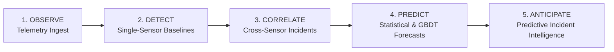
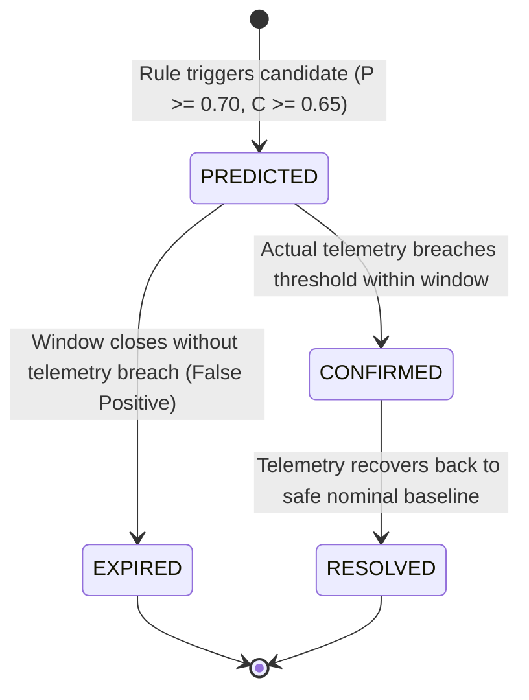

# Phase 5 Predictive Incident Intelligence: Architectural & Engineering Guide

This document specifies the architecture, mathematical principles, data models, and verification lifecycle of the **Predictive Incident Intelligence Engine** in the Home Intelligence Platform.

---

## 1. System Evolution & Architectural Vision

The Home Intelligence Platform progresses through five distinct, layered operational tiers:



| Operational Tier | Core Question | Primary Mechanism | State Classification |
| :--- | :--- | :--- | :--- |
| **Observe** | *What is happening right now?* | Multi-protocol ingestion pipeline, deduplication, physics simulator | `OBSERVED` |
| **Detect** | *Is this specific reading atypical?* | Telemetry baseline matrix, Z-score deviation, persistence comparison | `OBSERVED` / Anomaly |
| **Correlate** | *What unified event does this multi-sensor evidence describe?* | Spatiotemporal windowing, rule-based candidate aggregation, confidence scoring | `OBSERVED` / Incident |
| **Predict** | *What will this metric be over 15m to 24h?* | Seasonal diurnal decay, EMA, Gradient Boosted Trees (GBDT) | `PREDICTED` |
| **Anticipate** | *Will an actionable household incident emerge before it occurs?* | Multimodal predictive reasoning, analytical CDF crossing probability, lead-time interpolation | `PREDICTED` $\to$ `CONFIRMED` |

---

## 2. Strict Separation of Concerns & State Boundaries

To avoid cognitive ambiguity and operational alert fatigue, the platform enforces three mutually exclusive signal states:

1. **`OBSERVED`**: Deterministic sensor readings collected directly from physical or simulated devices (e.g., current power $1,450\text{ W}$, current living room temperature $23.2^\circ\text{C}$).
2. **`PREDICTED`**: An anticipatory candidate whose threshold breach has **not yet occurred** in real telemetry, but whose projected trajectory crosses critical physical limits within a future horizon (e.g., predicted CO₂ breach $> 1,000\text{ ppm}$ in 15 minutes).
3. **`CONFIRMED`**: A predictive incident whose anticipated conditions were subsequently verified by actual incoming telemetry within the forecast window ($\Delta t_{\text{actual}} = T_{\text{confirmed}} - T_{\text{predicted}}$), establishing ground-truth empirical precision.

```
                           +-------------------------------------------------------+
                           |             TELEMETRY INGESTION PIPELINE              |
                           +-------------------------------------------------------+
                                                     |
                                                     v
                                 +---------------------------------------+
                                 |  Step 6: Anomaly Engine (Single)      |
                                 +---------------------------------------+
                                                     |
                                                     v
                                 +---------------------------------------+
                                 |  Step 7: Cross-Sensor Incident Engine |
                                 +---------------------------------------+
                                                     |
                                                     v
                                 +---------------------------------------+
                                 |  Step 8: Predictive Incident Engine   |
                                 +---------------------------------------+
                                          /          |          \
                                         /           |           \
                                        v            v            v
                               +-------------+ +-----------+ +-------------+
                               | Rule: CO2   | | Rule: AC  | | Rule: Surge |
                               | Ventilation | | Failure   | | & Thermal   |
                               +-------------+ +-----------+ +-------------+
                                        \            |            /
                                         \           |           /
                                          v          v          v
                                 +---------------------------------------+
                                 |  Mathematical Reasoning & CDF Scoring |
                                 +---------------------------------------+
                                                     |
                                                     v
                                 +---------------------------------------+
                                 |  Deduplication & Cooldown (30 min)    |
                                 +---------------------------------------+
                                                     |
                                                     v
                                 +---------------------------------------+
                                 |  PredictiveIncident Table (Postgres)  |
                                 +---------------------------------------+
```

---

## 3. Supported Predictive Incident Scenarios

The engine evaluates four specialized rule suites during ingestion and evaluation runs:

### 1. `PREDICTED_CO2_VENTILATION`
- **Objective**: Anticipate hazardous indoor air quality accumulation before occupants experience cognitive fatigue or discomfort.
- **Trigger Conditions**:
  - Room occupancy sensor indicates active occupancy ($> 0.5$).
  - Current observed $\text{CO}_2 < 1,000\text{ ppm}$ (under critical comfort limit).
  - Time-series forecast (`STATISTICAL_SEASONAL_DECAY`) projects $\text{CO}_2 \ge 1,000\text{ ppm}$ within a $15\text{--}60$ minute horizon.
  - Calculated threshold crossing probability $P_{\text{crossing}} \ge 0.70$.
- **Actionable Advice**: "Open living room window or activate ventilation 10 minutes prior to breach."

### 2. `PREDICTED_AC_FAILURE`
- **Objective**: Detect cooling loss, compressor stall, or clogged thermal exchange before room temperature escalates beyond human comfort setpoints.
- **Trigger Conditions**:
  - HVAC circuit power sensor indicates active compressor consumption ($> 350\text{ W}$).
  - Current room temperature $< 24.0^\circ\text{C}$ (comfort threshold).
  - Room is occupied.
  - Temperature trend and forecast show sustained positive departure ($\ge 24.0^\circ\text{C}$) despite compressor power draw.
  - Calculated threshold crossing probability $P_{\text{crossing}} \ge 0.70$.
- **Actionable Advice**: "Inspect AC refrigerant charge or airflow filter; compressor drawing energy without thermodynamic heat extraction."

### 3. `PREDICTED_ENERGY_SURGE`
- **Objective**: Preemptively forecast household peak demand spikes ($> 2,000\text{ W}$) to enable load shedding or peak-tariff avoidance.
- **Trigger Conditions**:
  - Whole-home aggregate active power $< 2,000\text{ W}$.
  - Machine-learning tree ensemble (`ML_GRADIENT_BOOSTING`) projects aggregate load exceeding $2,000\text{ W}$ across the next $1\text{--}4$ hours.
  - Calculated threshold crossing probability $P_{\text{crossing}} \ge 0.60$, confidence $\ge 0.65$.
- **Actionable Advice**: "Defer EV charging or laundry cycle; dinner cooking load projected to breach $2,000\text{ W}$ threshold in $\sim 15$ minutes."

### 4. `PREDICTED_THERMAL_BREACH`
- **Objective**: Early warning of rapid interior heat loss caused by an open exterior window during extreme cold ambient temperature gradients.
- **Trigger Conditions**:
  - Window contact sensor state is `OPEN` ($1.0$).
  - Outdoor ambient temperature is substantially colder than indoor temperature ($\Delta T \ge 4.0^\circ\text{C}$).
  - Current room temperature $\ge 18.0^\circ\text{C}$.
  - Physical thermal decay influx model projects interior temperature falling below $18.0^\circ\text{C}$ in $< 60$ minutes.
  - Downward crossing probability $P_{\text{crossing}} \ge 0.70$.
- **Actionable Advice**: "Close exterior window; interior temperature projected to collapse below $18.0^\circ\text{C}$ in $\sim 18$ minutes."

---

## 4. Mathematical Reasoning Formulation

The engine completely avoids arbitrary heuristic scores and hallucinated machine-learning probabilities. All probabilistic metrics are derived using analytical statistical mechanics.

### 4.1. Analytical Normal CDF Threshold Crossing Probability

Given a forecast point $\hat{y}_{t+h}$ at horizon $h$ with standard error $s_h$, the predicted value is modeled as a normal distribution $Y_{t+h} \sim \mathcal{N}(\hat{y}_{t+h}, s_h^2)$.

#### Upward Crossing ($Y > T$)
The probability that the true future telemetry value exceeds threshold $T$ is:

$$z = \frac{\hat{y}_{t+h} - T}{s_h}$$

$$P(Y_{t+h} > T) = \Phi(z) = \frac{1}{2} \left[1 + \text{erf}\left(\frac{z}{\sqrt{2}}\right)\right]$$

#### Downward Crossing ($Y < T$)
The probability that the true future telemetry value drops below threshold $T$ is:

$$z = \frac{T - \hat{y}_{t+h}}{s_h}$$

$$P(Y_{t+h} < T) = \Phi(z) = \frac{1}{2} \left[1 + \text{erf}\left(\frac{z}{\sqrt{2}}\right)\right]$$

The Gauss error function $\text{erf}(x)$ is computed via the high-precision Abramowitz & Stegun approximation (Formula 7.1.26), guaranteeing maximal error $|\epsilon(x)| < 1.5 \times 10^{-7}$:

$$\text{erf}(x) = 1 - (a_1 t + a_2 t^2 + a_3 t^3 + a_4 t^4 + a_5 t^5) e^{-x^2}, \quad t = \frac{1}{1 + px}$$

### 4.2. Multimodal Predictive Confidence Score

Confidence $C \in [0.10, 0.99]$ synthesizes four orthogonal dimensions of certainty:

$$C = \min\left(0.99, \max\left(0.10, w_1 P_{\text{crossing}} + w_2 S_{\text{ratio}} + w_3 T_{\text{align}} + w_4 R_{\text{model}}\right)\right)$$

| Component | Weight ($w_i$) | Formulation | Description |
| :--- | :--- | :--- | :--- |
| **Statistical Probability** | $0.40$ | $P_{\text{crossing}} \in [0, 1]$ | Analytical CDF probability of crossing threshold $T$. |
| **Sensor Evidence** | $0.35$ | $S_{\text{ratio}} = \frac{\sum w_{\text{satisfied}}}{\sum w_{\text{total}}}$ | Proportion of multi-sensor contextual conditions satisfied. |
| **Trend Alignment** | $0.15$ | $T_{\text{align}} \in \{0.2, 1.0\}$ | $1.0$ if instantaneous drift matches forecast trajectory; $0.2$ if divergent. |
| **Model Reliability** | $0.10$ | $R_{\text{model}} \in [0.70, 0.95]$ | Historical empirical validation score of the underlying forecast provider. |

### 4.3. Continuous Lead-Time Linear Interpolation

Instead of quantizing lead time to the 15-minute forecast discrete grid, the exact minute of anticipated breach is computed by linear interpolation across adjacent forecast points $(t_1, y_1)$ and $(t_2, y_2)$ surrounding threshold $T$:

$$\Delta t_{\text{lead}} = t_1 + \frac{T - y_1}{y_2 - y_1} (t_2 - t_1)$$

$$\text{Expected Crossing Time} = T_{\text{current}} + \Delta t_{\text{lead}} \cdot 60,000\text{ ms}$$

---

## 5. Verification Lifecycle & Ground-Truth Confirmation

To guarantee that predictive warnings remain grounded and measurable, the engine executes continuous retrospective verification:



### Transition Logic:
1. **Confirmation (`PREDICTED` $\to$ `CONFIRMED`)**:
   - Evaluated during subsequent telemetry batches.
   - If an actual `Incident` is generated by the Phase 2 cross-sensor engine for the same room and failure domain within the horizon window, the warning transitions to `CONFIRMED`.
   - `confirmedIncidentId` foreign key is set to link the prediction directly to the actual incident.
   - Ground truth outcome is flagged as `PredictionOutcome.TRUE_POSITIVE`.
   - Realized advance lead time is calculated: $\Delta t_{\text{actual}} = T_{\text{incident}} - T_{\text{predicted}}$.

2. **Expiration (`PREDICTED` $\to$ `EXPIRED`)**:
   - If the anticipated window ($T_{\text{predicted}} + \text{horizonMinutes}$) expires and telemetry never breached the threshold, the warning transitions to `EXPIRED`.
   - Ground truth outcome is flagged as `PredictionOutcome.FALSE_POSITIVE`.

---

## 6. REST API Reference

### `GET /api/predictive-incidents`
Lists predictive incidents with optional query filters:
- `homeId` (required): Target home UUID.
- `status` (optional): Filter by `PREDICTED`, `CONFIRMED`, `RESOLVED`, `EXPIRED`.
- `type` (optional): Filter by scenario enum.
- `limit` (optional, default 50).

### `POST /api/predictive-incidents`
Triggers synchronous on-demand evaluation of predictive rules across the home.
- Body: `{ homeId: string }`
- Returns: Array of generated predictive incidents.

### `GET /api/predictive-incidents/[id]`
Retrieves full details of a predictive incident, including contributing multi-sensor evidence JSON, confidence intervals, and linked confirmed `Incident`.

### `PATCH /api/predictive-incidents/[id]`
Manually updates status or records user feedback/verification.
- Body: `{ status?: PredictiveIncidentStatus, outcome?: PredictionOutcome }`

### `GET /api/predictive-incidents/metrics?homeId=...`
Computes empirical performance metrics:
```json
{
  "totalPredicted": 8,
  "confirmedTruePositives": 4,
  "expiredFalsePositives": 0,
  "pendingEvaluation": 0,
  "empiricalPrecision": 1.0,
  "falsePositiveRate": 0.0,
  "averageLeadTimeMin": 15.75,
  "leadTimeStdDev": 1.30,
  "typeBreakdown": {
    "PREDICTED_CO2_VENTILATION": { "total": 1, "confirmed": 1, "precision": 1.0 },
    "PREDICTED_AC_FAILURE": { "total": 1, "confirmed": 1, "precision": 1.0 },
    "PREDICTED_ENERGY_SURGE": { "total": 1, "confirmed": 1, "precision": 1.0 },
    "PREDICTED_THERMAL_BREACH": { "total": 1, "confirmed": 1, "precision": 1.0 }
  }
}
```
